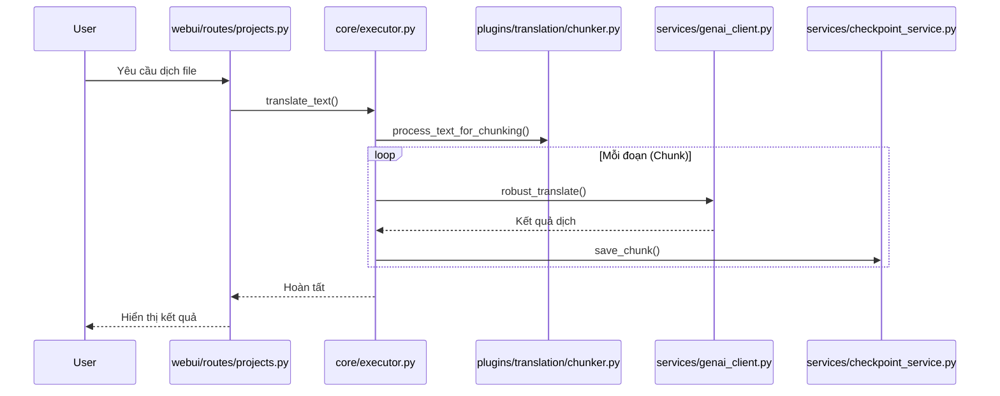
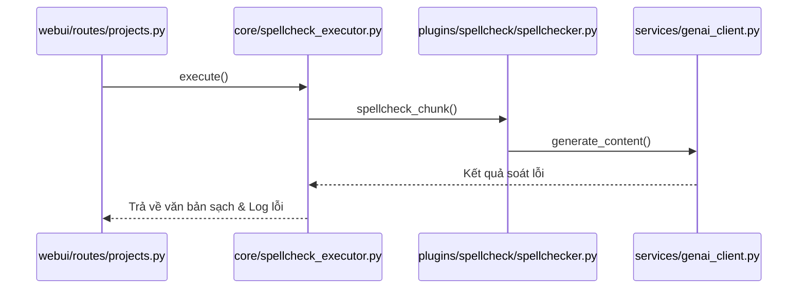
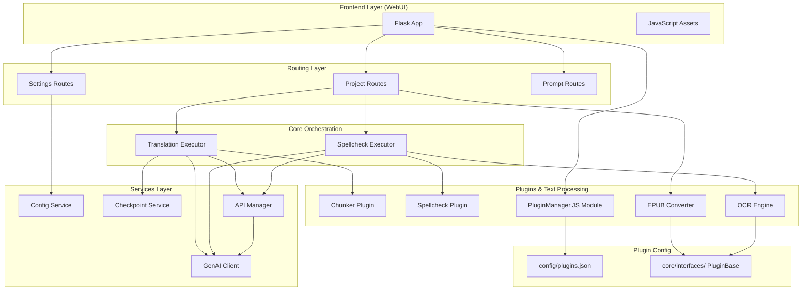

# Architecture Documentation - Novel-Translator

Tài liệu này mô tả cấu trúc kiến trúc của hệ thống Novel-Translator (Content Translator), dựa trên phân tích từ GitNexus Knowledge Graph.

## 1. Overview (Tổng quan)
Novel-Translator là một ứng dụng dịch thuật thông minh hỗ trợ nhiều định dạng (Text, EPUB, PDF/Image) với cơ chế quản lý dự án, checkpoint và tích hợp các mô hình AI tiên tiến (Gemini, OpenAI). Kiến trúc được thiết kế theo dạng module hóa với các executors độc lập và hệ thống plugin linh hoạt.

## 2. Functional Areas (Các phân vùng chức năng)

Hệ thống được chia thành 5 phân vùng chính:

### A. WebUI & Routes (Giao diện & Điều hướng)
- **Clusters**: `Webui`, `Routes`
- **Nhiệm vụ**: Cung cấp giao diện người dùng Flask, quản lý các điểm cuối API.
- **UI Structure (v7.8.0)**: Main navigation: Dự án, Cấu hình, Chỉ dẫn AI, Nhật ký, Lưu trữ. Workspace project: Biên tập, Thông tin, Chỉ dẫn, eBook Kit (plugin), OCR Toolbox (plugin).
- **State Persistence**: Sử dụng `localStorage` để duy trì trạng thái làm việc (active tabs, project selection) xuyên suốt các phiên làm việc.
- **Files chính**: `webui/__init__.py`, `webui/routes/*.py`, `webui/static/js/main.js`.

### B. Core Executors (Bộ thực thi lõi)
- **Clusters**: `Services`, `Cluster_4`
- **Nhiệm vụ**: Điều phối các tác vụ dịch thuật và soát lỗi phức tạp. Chịu trách nhiệm gọi chunking, quản lý tiến độ và lưu trữ checkpoint.
- **Files chính**: `core/executor.py`, `core/spellcheck_executor.py`.

### C. Services (Dịch vụ dùng chung)
- **Clusters**: `Services`
- **Nhiệm vụ**: Quản lý cấu hình, kết nối API AI, quản lý cache và dịch vụ checkpoint (lưu/khôi phục trạng thái).
- **Files chính**: `services/genai_client.py`, `services/checkpoint_service.py`, `services/config_service.py`.

### D. Plugins & Logic (Tiện ích mở rộng)
- **Clusters**: `Translation`, `Ocr`, `PluginManagement`
- **Nhiệm vụ**: Thực hiện các tác vụ chuyên biệt như chia nhỏ văn bản (Chunking), xử lý dịch thô, soát lỗi chính tả AI, chuyển đổi EPUB, OCR.
- **Plugin System (v7.8.0)**: `PluginBase`/`ConverterPlugin` interfaces trong `core/interfaces/__init__.py`. Quản lý plugin tập trung qua `config/plugins.json` + `PluginManager` JS module.
- **Files chính**: `plugins/translation/chunker.py`, `plugins/spellcheck/spellchecker.py`, `webui/static/js/plugin-manager.js`, `webui/routes/plugins.py`.

### E. Text Processing (Xử lý văn bản)
- **Clusters**: `Text_to_epub`, `Epub_to_text`, `Epub_converter`
- **Nhiệm vụ**: Chuyển đổi qua lại giữa các định dạng tệp và xử lý OCR cho hình ảnh/PDF.
- **Files chính**: `plugins/ocr/*.py`, `plugins/epub/*.py`.

## 3. Key Execution Flows (Luồng thực thi chính)

### Luồng Dịch thuật (Translation Flow)

### Luồng Soát lỗi (Spellcheck Flow)

## 4. Architecture Diagram (Sơ đồ kiến trúc tổng thể)

## 5. Summary Statistics
- **Files**: 90+
- **Symbols**: 1040+
- **Execution Flows**: 92+
- **Key Cluster**: `Services` (Chứa logic lõi của hệ thống)

---
*Tài liệu được tạo tự động bởi GitNexus Knowledge Graph — cập nhật lần cuối: v8.2.0.*
