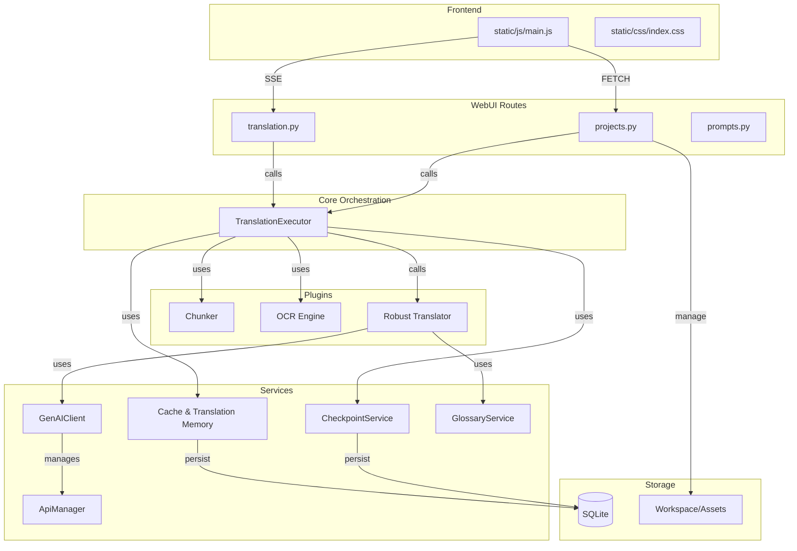

# 🏛️ Architecture Documentation: Novel-Translator

This document describes the high-level architecture and execution flows of the Novel-Translator project, based on the knowledge graph analysis.

## 1. Overview

Novel-Translator is a professional-grade content translation ecosystem optimized for Gemini AI and OpenAI-compatible APIs. It follows a modular, service-oriented architecture designed for efficiency (caching/TM), reliability (checkpointing), and premium user experience.

## 2. Functional Areas (Modules)

Based on cluster analysis, the codebase is organized into several key functional areas:

- **WebUI (Frontend & API)**: Modularized using Flask Blueprints.
  - `webui/routes/projects.py`: Manages workspaces, sources, and file organization.
  - `webui/routes/translation.py`: Handles the Server-Sent Events (SSE) streaming worker.
  - `webui/routes/prompts.py`: Manages the streamlined prompt library.
- **Core Executor**: The central orchestrator.
  - `core/executor.py`: Implements `TranslationExecutor`, which coordinates the translation pipeline.
- **Services Layer**: Domain-specific logic and infrastructure.
  - `GenAIClient`: Universal adapter for AI providers.
  - `CheckpointService`: Ensures translation integrity using SQLite (WAL mode).
  - `TranslationCache` & `TranslationMemory`: Cost optimization via result reuse.
  - `GlossaryService`: Dynamic terminology injection.
  - `ApiManager`: Advanced rate-limiting and key rotation.
- **Plugins**: Specialized processing units.
  - `ocr/`: PDF and image text extraction engine.
  - `translation/chunker.py`: Intelligent text splitting (Sentence Aggregation).
  - `translation/translator.py`: Robust API calling logic with normalization.

## 3. Core Architecture Diagram

The following diagram illustrates the relationships between major components:

## 4. Key Execution Flows

### A. Translation Workflow (SSE)
1. **Entry**: `webui/routes/translation.py:translate_worker`
2. **Process**: Calls `TranslationExecutor.translate_text`.
3. **Chunking**: `plugins/translation/chunker.py` splits text into sentence-aware chunks.
4. **Resumption**: `CheckpointService` checks for existing progress.
5. **Memory/Cache**: `TranslationMemory` searches for fuzzy matches; `TranslationCache` checks for exact hits.
6. **AI Call**: If no cache, `robust_translate` calls `GenAIClient` via `ApiManager`.
7. **Post-process**: Result is normalized, saved to `CheckpointService`, and emitted via SSE to the UI.

### B. Project File Processing
1. **Entry**: `webui/routes/projects.py:chunk_project_file`
2. **Analysis**: `Chunker` analyzes the file structure.
3. **Transformation**: Titles are wrapped, and best cut positions are calculated.
4. **Storage**: Chunks are registered in the project metadata for the Side-by-Side editor.

### C. OCR Pipeline
1. **Entry**: `plugins/ocr/ocr_engine.py:hybrid_workflow_pdf_to_docx`
2. **Extraction**: `extract_paragraphs_with_hints` uses bundled binaries.
3. **Caching**: Image and text hashes are verified against `CacheService` to skip redundant OCR.

## 5. Development Guidelines

- **Naming**: Use `snake_case` for Python and `camelCase` for JS.
- **Modularity**: Keep logic in `Services` or `Plugins`. Routes should only handle request/response.
- **Persistence**: Always use `CheckpointService` for long-running tasks to allow resumption.
- **UI**: Use Tachyons utilities and the CSS radio-tab pattern for the dashboard.
