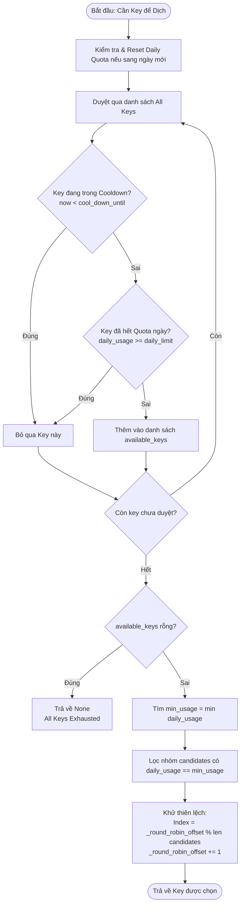

# 🔑 Kiến Trúc & Cơ Chế Xoay Vòng API Key (API Key Rotation Architecture)

Tài liệu này mô tả chi tiết kiến trúc, giải thuật điều phối và quy trình xử lý xoay vòng API Key (đặc biệt tối ưu cho Google Gemini API và hỗ trợ OpenAI-Compatible Providers) trong hệ thống **Novel-Translator**.

---

## 1. Tổng Quan & Bối Cảnh

Trong quá trình dịch thuật tài liệu/tiểu thuyết dung lượng lớn, việc tương tác với các AI Provider (đặc biệt là gói **Google Gemini Free Tier**) thường xuyên gặp phải các rào cản hạn ngạch (Rate Limits & Quotas):
- **15 RPM** (Requests Per Minute): Giới hạn toàn cục trên địa chỉ IP / Tài khoản.
- **1,500 RPD** (Requests Per Day): Giới hạn số lượt gọi trong 24 giờ cho mỗi API Key.
- **1,000,000 TPM** (Tokens Per Minute): Giới hạn lưu lượng token trong một phút.

Hệ thống Novel-Translator xây dựng mô hình **Kiểm soát Tốc độ 2 Tầng (Dual-Layer Rate Limiting)** kết hợp **Xoay vòng Key Thích ứng (Adaptive Key Rotation)** để tối đa hóa thông lượng (throughput), bảo vệ địa chỉ IP và đảm bảo phiên dịch không bị đình trệ khi một hoặc nhiều key cạn quota.

```
                  ┌───────────────────────────────────────────────────────────┐
                  │                 config/providers.json                     │
                  │   (Lưu trữ danh sách API Keys của Provider "gemini")      │
                  └─────────────────────────────┬─────────────────────────────┘
                                                │
                                                ▼
                  ┌───────────────────────────────────────────────────────────┐
                  │            ProviderService / ApiKeyService                │
                  │             (Nạp cấu hình & danh sách keys)               │
                  └─────────────────────────────┬─────────────────────────────┘
                                                │
                                                ▼
                  ┌───────────────────────────────────────────────────────────┐
                  │                   TranslationExecutor                     │
                  │         (Khởi tạo ApiManager cho phiên dịch)              │
                  └─────────────────────────────┬─────────────────────────────┘
                                                │
                                                ▼
         ┌─────────────────────────────────────────────────────────────────────────┐
         │                               ApiManager                                │
         │   ┌───────────────────────────┐     ┌───────────────────────────────┐   │
         │   │   GlobalRPMRateLimiter    │     │      AdaptiveRateLimiter      │   │
         │   │   - Sliding Window 60s    │     │  - Theo dõi RPD/TPD từng Key  │   │
         │   │   - Giới hạn 15 RPM IP    │     │  - Quản lý Cooldown & Retry   │   │
         │   └───────────────────────────┘     │  - Chiến lược Least-Used / RR │   │
         │                                     └───────────────────────────────┘   │
         └──────────────────────────────────────┬──────────────────────────────────┘
                                                │
                                                ▼
         ┌─────────────────────────────────────────────────────────────────────────┐
         │                    plugins/translation/translator.py                    │
         │   1. api_manager.acquire_rpm() ──► Chờ token RPM toàn cục              │
         │   2. api_manager.get_next_available_key() ──► Chọn key tối ưu           │
         │   3. _get_client(key) ──► Lấy GenAIClient từ _client_cache             │
         │   4. client.generate_content() ──► Gửi request sang Google             │
         │   5. Phân loại kết quả:                                                │
         │      ├── Thành công: api_manager.mark_success(key)                      │
         │      └── Thất bại: api_manager.handle_api_error(key, error)             │
         └─────────────────────────────────────────────────────────────────────────┘
```

---

## 2. Các Thành Phần Cốt Lõi (Core Components)

### 2.1. `ProviderService` & `ApiKeyService`
- **Tập tin:** [`backend/infrastructure/providers/provider_service.py`](file:///Users/narga/Briefcase/Projects/Novel-Translator/backend/infrastructure/providers/provider_service.py), [`backend/infrastructure/config/api_key_service.py`](file:///Users/narga/Briefcase/Projects/Novel-Translator/backend/infrastructure/config/api_key_service.py)
- **Nhiệm vụ:**
  - `config/providers.json` là "nguồn sự thật duy nhất" (Single Source of Truth).
  - Quản lý mảng `api_keys` cho provider `gemini` và lưu trữ secret an toàn.
  - Tự động nạp danh sách key và cung cấp cấu hình giới hạn (`max_rpm`, `rpd_per_key`).

### 2.2. `ApiManager` (Trọng Tài Điều Phối Trung Tâm)
- **Tập tin:** [`services/api_service.py`](file:///Users/narga/Briefcase/Projects/Novel-Translator/services/api_service.py#L350)
- **Nhiệm vụ:**
  - Khởi tạo và liên kết đồng thời `GlobalRPMRateLimiter` và `AdaptiveRateLimiter`.
  - Nhận diện provider type để tự động gán thông số:
    - **Gemini:** `max_rpm = 15`, `rpd_per_key = 1500`.
    - **OpenAI/Custom:** `max_rpm = 20`, `rpd_per_key = 1000000`.
  - Điều phối việc lấy key tiếp theo qua `get_next_available_key()`.
  - Cung cấp interface thread-safe cho các worker.

### 2.3. `GlobalRPMRateLimiter` (Bảo Vệ IP Cấp Toàn Cục)
- **Tập tin:** [`services/api_service.py`](file:///Users/narga/Briefcase/Projects/Novel-Translator/services/api_service.py#L14)
- **Cơ chế:** Sử dụng giải thuật **Sliding Window Log** (Cửa sổ trượt 60 giây) với `collections.deque`.
- **Mục đích:** Bất kể hệ thống cấu hình bao nhiêu API key hay chạy bao nhiêu tiến trình song song, tổng số request phát ra từ máy chủ không vượt quá `max_rpm` (mặc định 15 RPM), ngăn chặn Google tạm khóa hoặc chặn IP.

### 2.4. `AdaptiveRateLimiter` (Quản Lý Trạng Thái Từng Key)
- **Tập tin:** [`services/api_service.py`](file:///Users/narga/Briefcase/Projects/Novel-Translator/services/api_service.py#L86)
- **Theo dõi độc lập từng Key:**
  - `daily_usage: Dict[str, int]`: Số request đã thực hiện trong ngày.
  - `daily_tokens: Dict[str, int]`: Số lượng token đã tiêu thụ trong ngày.
  - `failure_count: Dict[str, int]`: Số lần gặp lỗi liên tiếp của key.
  - `cool_down_until: Dict[str, float]`: Thời điểm (epoch timestamp) key hết hạn cách ly và được phép thử lại.
  - `last_reset_date: str`: Ngày reset quota định kỳ (`YYYY-MM-DD`).

### 2.5. `GenAIClient` & Client Cache Pool
- **Tập tin:** [`services/genai_client.py`](file:///Users/narga/Briefcase/Projects/Novel-Translator/services/genai_client.py), [`plugins/translation/translator.py`](file:///Users/narga/Briefcase/Projects/Novel-Translator/plugins/translation/translator.py#L26-L65)
- **Cơ chế:** Lưu trữ phiên bản khởi tạo `genai.Client` trong từ điển toàn cục `_client_cache` theo khóa băm `md5(api_key + gateway + credential_mode)`. Tránh overhead khởi tạo lại SDK client trên mỗi chunk dịch.

---

## 3. Diễn Giải Chi Tiết Giải Thuật

### 3.1. Thuật Toán Lựa Chọn Key (`least_used` Selection)

Hệ thống mặc định sử dụng chiến lược **`least_used`** để dàn đều tải trên toàn bộ pool key.



#### Công thức Khử Thiên Lệch (Tie-Breaking Mechanism):
Khi nhiều key có cùng số lượt sử dụng thấp nhất (ví dụ: đầu ngày khi tất cả đều có `usage = 0`):
$$\text{chosen\_key} = \text{candidates}\Big[\text{\_round\_robin\_offset} \pmod{|\text{candidates}|}\Big]$$
$$\text{\_round\_robin\_offset} \leftarrow \text{\_round\_robin\_offset} + 1$$
Điều này đảm bảo các request liên tiếp sẽ lần lượt kích hoạt từng key khác nhau thay vì dồn toàn bộ tải vào key đầu tiên của mảng.

---

### 3.2. Thuật Toán Cửa Sổ Trượt Kiểm Soát RPM (`Sliding Window Log`)

`GlobalRPMRateLimiter` quản lý một hàng đợi thời gian (`deque`):
1. **Làm sạch Log cũ:** Loại bỏ các timestamp cũ hơn $t - 60.0\text{s}$.
2. **Kiểm tra Ngưỡng:**
   - Nếu $\text{len}(\text{deque}) < \text{max\_rpm}$: Thêm $t_{\text{current}}$ vào cuối hàng đợi, tăng `total_requests` và cấp quyền request (`True`).
   - Nếu $\text{len}(\text{deque}) \ge \text{max\_rpm}$:
     - `blocking=False`: Trả về `False` ngay lập tức.
     - `blocking=True`: Ngủ `0.1s` và thử lại cho đến khi có khe trống hoặc vượt quá `timeout` (120s).

---

### 3.3. Phân Loại Lỗi & Tính Toán Cooldown Thích Ứng

Khi xảy ra lỗi từ API, hàm `AdaptiveRateLimiter.should_retry(api_key, error)` phân loại lỗi và đưa ra quyết định dựa trên bảng quy tắc sau:

| Nhóm Lỗi | Mẫu Nhận Diện (Error Keywords) | Quyết Định Retry (`should_retry`) | Thời Gian Chờ (`delay`) | Thời Gian Cách Ly (`cool_down_until`) |
| :--- | :--- | :---: | :---: | :---: |
| **Cạn Hạn Mức Ngày** | `quota`, `resource_exhausted` | `False` | `0s` *(Chuyển key tức thì)* | **30 phút** (`1800s`) |
| **Rate Limit Tạm Thời** | `rate limit`, `429` ($f \le 8$) | `True` | $\min(30 \times 2^{f-1}, 300)\text{s}$<br>*(30s, 60s, 120s, 240s, 300s)* | Không cách ly |
| **Rate Limit Kéo Dài** | `rate limit`, `429` ($f > 8$) | `False` | `1800s` | **30 phút** (`1800s`) |
| **Key Chết / Sai Quyền** | `api_key_invalid`, `api key not found`, `invalid api key`, `permission_denied`, `unauthenticated` | `False` | `0s` *(Chuyển key tức thì)* | **24 giờ** (`86400s`) *(Loại bỏ khỏi phiên)* |
| **Lỗi Mạng / Timeout** | `timeout`, `deadline`, `connection` ($f \le 5$) | `True` | $\min(10 \times f, 60)\text{s}$<br>*(10s, 20s, 30s, 40s, 50s, 60s)* | Không cách ly |
| **Lỗi Mạng Nghiêm Trọng**| `timeout`, `deadline`, `connection` ($f > 5$) | `False` | `300s` | **5 phút** (`300s`) |
| **Lỗi Khác** | Ngoại lệ chung ($f \le 3$) | `True` | `5.0s` | Không cách ly |

---

## 4. Vòng Đời Request Hoàn Chỉnh (Request Lifecycle)

```
[TranslationExecutor]
       │
       ▼ (Dịch từng Chunk)
[plugins/translation/translator.py :: _call_api]
       │
       ├──► 1. check_emergency_stop() ──► Dừng khẩn cấp nếu có yêu cầu
       ├──► 2. api_manager.acquire_rpm() ──► Chờ token RPM toàn cục (Sliding Window)
       ├──► 3. api_manager.get_next_available_key() ──► Lấy key tối ưu (least_used)
       │         │
       │         ├── Nếu trả về None và all_keys_exhausted() == True:
       │         │     └── Báo lỗi "all_keys_exhausted" và dừng task an toàn.
       │         │
       │         └── Nếu lấy được api_key:
       ├──► 4. _get_client(api_key) ──► Lấy GenAIClient từ pool cache
       ├──► 5. client.generate_content(...) ──► Gọi Google Gemini API
       │         │
       │         ├── THÀNH CÔNG:
       │         │     ├── api_manager.mark_success(api_key)
       │         │     │     ├── failure_count[key] = 0
       │         │     │     ├── daily_usage[key] += 1
       │         │     │     └── Xóa cool_down_until[key]
       │         │     └── Trả về văn bản đã dịch.
       │         │
       │         └── THẤT BẠI:
       │               ├── api_manager.handle_api_error(api_key, error)
       │               ├── Nếu should_retry == True:
       │               │     └── time.sleep(delay) và thử lại với key hiện tại.
       │               └── Nếu should_retry == False:
       │                     └── Bỏ qua key lỗi, vòng lặp tự động lấy key tiếp theo.
```

---

## 5. Hướng Dẫn Cấu Hình Trong `config/providers.json`

Dưới đây là cấu hình mẫu cho provider `gemini` với danh sách nhiều key để xoay vòng:

```json
{
  "version": 1,
  "active_id": "gemini-default",
  "providers": [
    {
      "id": "gemini-default",
      "type": "gemini",
      "name": "Google Gemini",
      "api_keys": [
        "AIzaSyD-Key1-xxxx",
        "AIzaSyA-Key2-yyyy",
        "AIzaSyC-Key3-zzzz"
      ],
      "default_model": "gemini-2.5-flash",
      "max_rpm": 15,
      "rpd_per_key": 1500
    }
  ]
}
```

---

## 6. Lộ Trình Cải Tiến (Roadmap & Enhancements)

Các hạng mục tối ưu hóa tiếp theo cho hệ thống điều phối key (theo dõi tại [`docs/ROADMAP.md`](file:///Users/narga/Briefcase/Projects/Novel-Translator/docs/ROADMAP.md)):

1. **Key Pool Persistence (P0):** Lưu trữ trạng thái hạn ngạch (`daily_usage`, `cool_down_until`) xuống file JSON/SQLite để không bị mất khi ứng dụng khởi động lại.
2. **Chuẩn hóa Timezone Reset (P0):** Chuyển chu kỳ reset ngày từ UTC sang **Pacific Time (PT)** (`America/Los_Angeles`) để đồng bộ tuyệt đối với máy chủ Google.
3. **Active Key Health Check Suite (P1):** Bộ công cụ kiểm tra tính hợp lệ và đo latency của toàn bộ danh sách key trước khi bắt đầu dịch.
4. **Hybrid Tier Routing (P2):** Hỗ trợ kết hợp Free Keys và Paid Keys (Ưu tiên dùng hết Free Key trước khi kích hoạt Paid Key).
5. **Dynamic `Retry-After` Header Parsing (P2):** Đọc thời gian khuyến nghị chờ trực tiếp từ header HTTP / Exception Metadata của Google.
