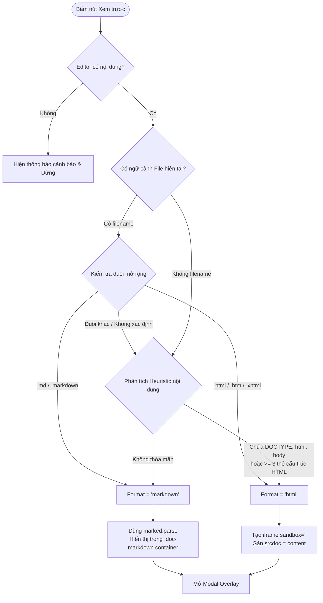

# ĐẶC TẢ KỸ THUẬT: PREVIEW NỘI DUNG EDITOR & TÍNH NĂNG XEM TÀI LIỆU (DOC VIEWER)

> **Mục tiêu tài liệu**: 
> 1. Trình bày chi tiết cơ chế, giải thuật và mã mẫu của nút **Preview** cho nội dung trong Editor (tự động phát hiện định dạng Markdown hoặc HTML).
> 2. Cung cấp chỉ dẫn chi tiết về cấu trúc, API backend, luồng xử lý bảo mật (chống Path Traversal) và giao diện người dùng của **Tính năng Xem tài liệu (Documentation Reader / Doc Viewer)** để tái tạo hoàn chỉnh trên dự án mới (`conntent-translator`).

---

## PHẦN 1: CƠ CHẾ & GIẢI THUẬT PREVIEW TRONG EDITOR (HTML & MARKDOWN)

### 1.1. Bối cảnh & Vị trí trong Hệ thống
Trong Novel-Translator, tính năng Preview nội dung Editor được đặt tại thanh công cụ phía trên mỗi khung soạn thảo văn bản (Tab "Dự án" -> Editor):
- Nút Preview cho khung văn bản **Nguồn** (`pm-source-text`).
- Nút Preview cho khung văn bản **Bản dịch** (`pm-result-text`).
- **Thư viện phụ thuộc**: 
  - `marked.min.js`: Dùng để parse chuỗi Markdown sang mã HTML an toàn.
  - CSS styling `.doc-markdown`: Định dạng chuẩn Typography cho Markdown đã render.

### 1.2. Giải thuật Tự Động Nhận Biết Định Dạng (Format Detection)

Hệ thống kết hợp 2 tầng nhận diện để chọn cách render tối ưu: **Đuôi mở rộng tập tin (File Extension)** và **Phân tích cú pháp nội dung (Heuristic Content Inspection)**.



#### Chi tiết giải thuật Heuristic:
1. **Ưu tiên 1 (File context)**: Nếu có `window.currentProjectFile.name`, lấy extension:
   - Nếu đuôi là `.md`, `.markdown` $\rightarrow$ `markdown`.
   - Nếu đuôi là `.html`, `.htm`, `.xhtml` $\rightarrow$ `html`.
2. **Ưu tiên 2 (Heuristic Content Fallback)**: Khi không có tên tệp (nội dung paste trực tiếp):
   - Kiểm tra pattern thẻ HTML toàn trang: `/<!DOCTYPE html>|<html[\s>]|<body[\s>]/i.test(content)`.
   - Hoặc kiểm tra mật độ các thẻ cấu trúc văn bản HTML phổ biến:
     `content.match(/<(div|p|h[1-6]|section|article|table|ul|ol)[>\s]/gi)`.
     Nếu số lượng thẻ này xuất hiện $\ge 3$ lần $\rightarrow$ `html`.
   - Mặc định còn lại $\rightarrow$ `markdown`.

---

### 1.3. Cơ Chế Cách Ly Bảo Mật (Sandboxing) & Hiển Thị
- **Đối với Markdown**: 
  - Render qua `marked.parse(content)`.
  - Nhúng vào thẻ `<div class="doc-markdown pa3" style="max-width: none;">`.
  - Áp dụng hệ thống kiểu dáng CSS thống nhất của hệ thống.
- **Đối với HTML**:
  - Nhúng vào thẻ iframe có cơ chế cách ly tuyệt đối: `<iframe sandbox="" srcdoc="" style="width:100%;height:70vh;border:none;display:block;"></iframe>`.
  - **Kỹ thuật tránh timing issue**: Thuộc tính `srcdoc` được gán **sau khi** thẻ iframe đã được gắn vào DOM (`document.body.appendChild(overlay)`).
  - Thuộc tính `sandbox=""` (empty) vô hiệu hóa toàn bộ script thực thi, form submission, popups, truy cập cookie/storage của trang gốc, bảo vệ người dùng trước các đoạn mã độc tiềm ẩn trong file HTML tải về từ web novel.

---

### 1.4. Mã Mẫu Triển Khai (Source Code Chuẩn)

#### 1. HTML Nút Preview (Gắn vào Toolbar Editor):
```html
<button class="ph2 pv1 f8 ba b--silver bg-white br1 pointer hover-bg-near-white" 
        onclick="EditorComponent.openPreview('pm-result-text', { label: 'Bản dịch' })" 
        title="Xem trước">
    <svg viewBox="0 0 24 24" fill="none" stroke="currentColor" stroke-width="2" 
         stroke-linecap="round" stroke-linejoin="round" style="width:14px;height:14px">
        <path d="M1 12s4-8 11-8 11 8 11 8-4 8-11 8-11-8-11-8z"/>
        <circle cx="12" cy="12" r="3"/>
    </svg>
</button>
```

#### 2. JavaScript Logic (`EditorComponent.openPreview` & Modal Overlay):
```javascript
const EditorComponent = {
    // Helper tạo Modal Overlay dùng chung
    _createOverlay({ title, subtitle, bodyHtml, wide }) {
        const overlay = document.createElement('div');
        overlay.className = 'fixed absolute--fill bg-black-70 items-center justify-center';
        overlay.style.cssText = 'display:flex; z-index:99999; top:0; left:0; right:0; bottom:0; position:fixed;';
        const widthClass = wide ? 'mw9' : 'mw8';
        const subtitleHtml = subtitle ? `<div class="f7 silver mt1">${subtitle}</div>` : '';

        overlay.innerHTML = `
            <div class="bg-white br3 shadow-5 w-100 ${widthClass} overflow-hidden" style="max-height:85vh; margin: auto;">
                <div class="pa3 bb b--black-10 bg-near-white flex justify-between items-center">
                    <div>
                        <h3 class="f5 ma0 fw6 dark-gray">${title}</h3>
                        ${subtitleHtml}
                    </div>
                    <button class="pointer bn bg-transparent f4 close-btn" onclick="this.closest('.fixed').remove()">&times;</button>
                </div>
                <div class="overflow-y-auto" style="max-height:75vh;">${bodyHtml}</div>
            </div>`;

        document.body.appendChild(overlay);

        // Đóng khi click ngoài khung modal
        overlay.addEventListener('click', function(e) {
            if (e.target === overlay) overlay.remove();
        });

        // Đóng khi nhấn phím Escape
        document.addEventListener('keydown', function onEsc(e) {
            if (e.key === 'Escape') {
                overlay.remove();
                document.removeEventListener('keydown', onEsc);
            }
        });

        return overlay;
    },

    // Hàm Preview chính
    openPreview(textareaId, options = {}) {
        const textarea = document.getElementById(textareaId);
        if (!textarea) return;

        const content = textarea.value;
        if (!content.trim()) {
            if (window.UiHelpers && typeof window.UiHelpers.showToast === 'function') {
                UiHelpers.showToast('Editor không có nội dung để preview', 'warning');
            } else {
                alert('Editor không có nội dung để preview');
            }
            return;
        }

        const label = options.label || 'Preview';
        const filename = (window.currentProjectFile && window.currentProjectFile.name) ? window.currentProjectFile.name : '';
        
        // 1. Nhận dạng định dạng
        let format = 'markdown';
        if (filename) {
            const ext = filename.split('.').pop().toLowerCase();
            if (ext === 'md' || ext === 'markdown') {
                format = 'markdown';
            } else if (ext === 'html' || ext === 'htm' || ext === 'xhtml') {
                format = 'html';
            }
        } else {
            // Heuristic kiểm tra nội dung
            const hasHtmlDocTag = /<!DOCTYPE html>|<html[\s>]|<body[\s>]/i.test(content);
            const structuralTags = (content.match(/<(div|p|h[1-6]|section|article|table|ul|ol)[>\s]/gi) || []).length;
            if (hasHtmlDocTag || structuralTags >= 3) {
                format = 'html';
            }
        }

        // 2. Chuẩn bị UI
        const subtitle = (filename ? `${filename} • ` : '') + (format === 'html' ? 'HTML' : 'Markdown');
        let bodyHtml;

        if (format === 'markdown') {
            const parsedHtml = (typeof marked !== 'undefined') ? marked.parse(content) : `<pre>${content}</pre>`;
            bodyHtml = `<div class="doc-markdown pa3" style="max-width: none;">${parsedHtml}</div>`;
        } else {
            bodyHtml = '<iframe sandbox="" srcdoc="" style="width:100%;height:70vh;border:none;display:block;"></iframe>';
        }

        const overlay = this._createOverlay({
            title: `Preview — ${label}`,
            subtitle: subtitle,
            bodyHtml: bodyHtml,
            wide: false
        });

        // 3. Gán srcdoc cho iframe an toàn sau khi đã vào DOM
        if (format === 'html') {
            const iframe = overlay.querySelector('iframe[sandbox]');
            if (iframe) {
                iframe.srcdoc = content;
            }
        }
    }
};
```

#### 3. CSS Tùy biến cho Markdown (`.doc-markdown`):
```css
.doc-markdown { max-width: 72ch; line-height: 1.6; color: #1e293b; }
.doc-markdown h1 { font-size: 1.6rem; font-weight: 700; margin: 0 0 1rem; border-bottom: 2px solid #e2e8f0; padding-bottom: 0.5rem; }
.doc-markdown h2 { font-size: 1.25rem; font-weight: 700; margin: 1.5rem 0 0.75rem; }
.doc-markdown h3 { font-size: 1rem; font-weight: 600; margin: 1rem 0 0.5rem; }
.doc-markdown p { margin: 0 0 0.75rem; }
.doc-markdown ul, .doc-markdown ol { padding-left: 1.5rem; margin: 0 0 0.75rem; }
.doc-markdown code { font-family: monospace; background: #f1f5f9; padding: 2px 5px; border-radius: 4px; font-size: 0.875em; color: #1d4ed8; }
.doc-markdown pre { background: #1e293b; color: #e2e8f0; padding: 1rem; border-radius: 6px; overflow-x: auto; margin: 0 0 1rem; }
.doc-markdown pre code { background: none; color: inherit; padding: 0; }
.doc-markdown blockquote { border-left: 4px solid #3b82f6; margin: 0 0 0.75rem; padding: 0.5rem 1rem; background: #eff6ff; border-radius: 0 6px 6px 0; color: #1e40af; }
.doc-markdown table { border-collapse: collapse; width: 100%; margin: 0 0 1rem; font-size: 0.875rem; }
.doc-markdown th, .doc-markdown td { padding: 0.5rem 0.75rem; border: 1px solid #e2e8f0; }
.doc-markdown th { background: #f8fafc; font-weight: 600; }
.doc-markdown tr:hover td { background: #f8fafc; }
```

---

## PHẦN 2: CHỈ DẪN CHI TIẾT TÍNH NĂNG XEM TÀI LIỆU (DOC VIEWER)

Tính năng Xem tài liệu (**Tab "Tài liệu"**) cho phép lập trình viên và người vận hành đọc toàn bộ tài liệu kỹ thuật, hướng dẫn, đặc tả (`.md`, `.txt`, `.html`) của dự án ngay trên giao diện Web mà không cần mở editor ngoài.

### 2.1. Kiến Trúc Tổng Thể

```
┌─────────────────────────────────────────────────────────────┐
│                       GIAO DIỆN NGƯỜI DÙNG                   │
│  [ Ô tìm kiếm nhanh ]   │  Tiêu đề tài liệu + Đường dẫn     │
│  ─────────────────────  │  ───────────────────────────────  │
│  📂 Thư mục gốc         │                                   │
│    📄 README.md         │  Hiển thị nội dung render:        │
│    📝 CHANGELOG.md      │  - .md: marked.js render HTML     │
│  📂 docs                │  - .txt/.html: preformatted text  │
│    📄 MANUAL.md         │                                   │
│  ⚙ Cấu hình thư mục quét│                                   │
└──────────────┬───────────────────────────────▲──────────────┘
               │ HTTP Requests                 │
               ▼                               │
┌─────────────────────────────────────────────────────────────┐
│                      FLASK BACKEND API                      │
│  1. GET  /api/docs/config  --> Đọc danh sách thư mục cho phép│
│  2. POST /api/docs/config  --> Cập nhật thư mục vào app.ini │
│  3. GET  /api/docs         --> Quét danh sách file hợp lệ   │
│  4. GET  /api/docs/content --> Đọc nội dung file & bảo mật  │
└─────────────────────────────────────────────────────────────┘
```

### 2.2. Các Nguyên Tắc Bảo Mật Cốt Lõi (Security Rules)

1. **Chống Path Traversal (`../`)**:
   - Sử dụng `Path.resolve()` để giải quyết đường dẫn tuyệt đối.
   - Bắt buộc kiểm tra `str(target).startswith(str(workspace_root))` hoặc `target.relative_to(workspace_root)`.
2. **Kiểm Soát Vùng Quyền Hạn (Scope Authorization)**:
   - File chỉ được phép đọc nếu nằm trong:
     - Thư mục gốc (`target.parent == workspace_root`) khi `include_root == True`.
     - Các thư mục nằm trong danh sách trắng `DOCS.INCLUDED_PATHS` (ví dụ: `docs`, `.agent`, `.agents`, v.v.).
   - Tuyệt đối không cho phép truy cập ra ngoài thư mục dự án hoặc các thư mục hệ thống nhạy cảm (`.git`, `node_modules`, `.venv`).
3. **Giới hạn định dạng tệp (Extension Whitelist)**:
   - Chỉ cho phép: `.md`, `.txt`, `.html`. Bỏ qua các file nhị phân, `.py`, `.json`, `.env`, file cấu hình nhạy cảm.

---

### 2.3. Chi Tiết API Endpoints (Backend Specs)

#### 1. `GET /api/docs/config`
- **Mô tả**: Trả về cấu hình thư mục quét hiện tại.
- **Phản hồi**:
```json
{
  "paths": "docs, .agent, .agents, .cloud",
  "include_root": true
}
```

#### 2. `POST /api/docs/config`
- **Mô tả**: Lưu cấu hình thư mục quét vào `app.ini` hoặc `config.json`.
- **Payload**:
```json
{
  "paths": "docs, specs, guides",
  "include_root": true
}
```
- **Phản hồi**: `{"success": true}`

#### 3. `GET /api/docs`
- **Mô tả**: Quét hệ thống tệp và trả về danh sách tài liệu. Thư mục gốc không quét đệ quy; các thư mục cấu hình được quét đệ quy (`rglob`).
- **Phản hồi**:
```json
[
  {
    "path": "README.md",
    "name": "README.md",
    "ext": ".md",
    "dir": ""
  },
  {
    "path": "docs/MANUAL.md",
    "name": "MANUAL.md",
    "ext": ".md",
    "dir": "docs"
  }
]
```

#### 4. `GET /api/docs/content?path=<rel_path>`
- **Mô tả**: Đọc nội dung tệp văn bản theo đường dẫn tương đối (đã kiểm tra quyền).
- **Phản hồi thành công**:
```json
{
  "path": "docs/MANUAL.md",
  "ext": ".md",
  "content": "# Hướng dẫn sử dụng..."
}
```
- **Phản hồi lỗi**:
  - `400`: Thiếu tham số hoặc định dạng không hỗ trợ.
  - `403`: Không nằm trong danh mục tài liệu được cấp quyền (hoặc cố tình path traversal).
  - `404`: Tệp không tồn tại.

---

### 2.4. Mã Nguồn Backend Chuẩn (`routes/docs.py`)

Có thể tái sử dụng trực tiếp cho dự án mới:

```python
# routes/docs.py
import logging
from pathlib import Path
from flask import Blueprint, request, jsonify

logger = logging.getLogger(__name__)
docs_bp = Blueprint("docs", __name__)

ALLOWED_EXTENSIONS = {".txt", ".md", ".html"}

def get_workspace_root() -> Path:
    """Trả về đường dẫn tuyệt đối đến thư mục gốc của dự án."""
    return Path(__file__).resolve().parent.parent

def get_docs_config():
    """Đọc cấu hình từ app config (fallback giá trị an toàn)."""
    # Tuỳ thuộc hệ thống config của dự án mới (AppConfigService hoặc json config)
    # Ví dụ fallback:
    return ["docs", ".agent", ".agents"], True

@docs_bp.route("/api/docs")
def list_docs():
    workspace_root = get_workspace_root()
    paths, include_root = get_docs_config()

    files = []
    seen_paths = set()

    # 1. Quét tệp ở thư mục gốc (không đệ quy)
    if include_root:
        for fp in sorted(workspace_root.iterdir()):
            if fp.suffix.lower() not in ALLOWED_EXTENSIONS or not fp.is_file():
                continue
            abs_path = fp.resolve()
            if abs_path in seen_paths:
                continue
            seen_paths.add(abs_path)
            files.append({
                "path": fp.name,
                "name": fp.name,
                "ext": fp.suffix.lower(),
                "dir": "",
            })

    # 2. Quét đệ quy các thư mục được chỉ định
    for path_str in paths:
        dir_path = (workspace_root / path_str.strip()).resolve()
        if not dir_path.exists() or not dir_path.is_dir():
            continue
        try:
            dir_path.relative_to(workspace_root)
        except ValueError:
            continue

        for fp in sorted(dir_path.rglob("*")):
            if fp.suffix.lower() not in ALLOWED_EXTENSIONS or not fp.is_file():
                continue
            abs_path = fp.resolve()
            if abs_path in seen_paths:
                continue
            seen_paths.add(abs_path)

            rel_to_workspace = fp.relative_to(workspace_root)
            parent_dir = str(rel_to_workspace.parent).replace("\\", "/")
            files.append({
                "path": str(rel_to_workspace).replace("\\", "/"),
                "name": fp.name,
                "ext": fp.suffix.lower(),
                "dir": "" if parent_dir == "." else parent_dir,
            })

    return jsonify(files)

@docs_bp.route("/api/docs/content")
def get_doc_content():
    rel_path = request.args.get("path", "").strip()
    if not rel_path:
        return jsonify({"error": "Thiếu tham số path"}), 400

    workspace_root = get_workspace_root()
    try:
        target = (workspace_root / rel_path).resolve()
        target.relative_to(workspace_root)  # Kiểm tra Path Traversal
    except (ValueError, Exception):
        logger.warning(f"Cảnh báo Path Traversal: {rel_path}")
        return jsonify({"error": "Truy cập bị từ chối"}), 403

    paths, include_root = get_docs_config()
    is_allowed = False

    if include_root and target.parent == workspace_root:
        is_allowed = True
    else:
        for path_str in paths:
            dir_path = (workspace_root / path_str.strip()).resolve()
            if str(target).startswith(str(dir_path)):
                is_allowed = True
                break

    if not is_allowed:
        return jsonify({"error": "Tệp tin không thuộc vùng tài liệu được cấp quyền"}), 403

    if not target.exists() or not target.is_file():
        return jsonify({"error": "Tài liệu không tồn tại"}), 404

    if target.suffix.lower() not in ALLOWED_EXTENSIONS:
        return jsonify({"error": "Định dạng tệp không được hỗ trợ"}), 400

    try:
        content = target.read_text(encoding="utf-8", errors="replace")
        return jsonify({
            "path": rel_path,
            "ext": target.suffix.lower(),
            "content": content
        })
    except Exception as e:
        return jsonify({"error": f"Lỗi đọc tệp: {str(e)}"}), 500
```

---

### 2.5. Mã Nguồn Giao Diện & Điều Khiển Frontend (`doc-manager.js`)

#### 1. Template Layout HTML:
```html
<section id="tab-docs" class="nt-tab-content">
    <div class="docs-layout flex flex-row" style="height: calc(100vh - 70px);">
        <!-- SIDEBAR -->
        <aside class="docs-sidebar ba b--black-10 bg-white flex flex-column" style="width: 320px;">
            <div class="pa3 bb b--black-10 bg-near-white flex justify-between items-center">
                <h2 class="f5 ma0 fw6 dark-gray">Tài liệu dự án</h2>
                <button class="pointer ph2 pv1 f7 ba b--black-10 bg-white br2" onclick="DocManager.loadDocList()">↻</button>
            </div>
            <div class="pa2 bb b--black-10">
                <input id="doc-search-filter" type="text" class="w-100 pa2 ba b--black-10 br2 f7" 
                       placeholder="🔍 Tìm nhanh tài liệu..." oninput="DocManager.filterList()">
            </div>
            <nav id="doc-list" class="flex-auto overflow-y-auto pa2">
                <p class="pa3 tc silver i f7">Đang tải...</p>
            </nav>
        </aside>

        <!-- MAIN READER -->
        <main class="docs-reader flex-auto ba b--black-10 bg-white ml2 flex flex-column">
            <div class="pa3 bb b--black-10 bg-near-white">
                <span id="doc-reader-title" class="f5 fw6 dark-gray">Chưa chọn tài liệu</span>
                <span id="doc-reader-path" class="f7 silver ml2"></span>
            </div>
            <div id="doc-reader-content" class="flex-auto overflow-y-auto pa4">
                <p class="tc silver i mt5">← Chọn tài liệu từ danh sách bên trái để bắt đầu đọc.</p>
            </div>
        </main>
    </div>
</section>
```

#### 2. JavaScript Quản Lý (`doc-manager.js`):
```javascript
const DocManager = {
    _loaded: false,
    _files: [],

    loadDocList() {
        const listEl = document.getElementById('doc-list');
        if (!listEl) return;

        if (!this._loaded) {
            listEl.innerHTML = '<p class="pa3 tc silver i f7">Đang tải...</p>';
        }

        fetch('/api/docs')
            .then(r => {
                if (!r.ok) throw new Error(`HTTP ${r.status}`);
                return r.json();
            })
            .then(files => {
                this._loaded = true;
                this._files = files;
                if (!files.length) {
                    listEl.innerHTML = '<p class="pa3 tc silver i f7">Không có tài liệu nào.</p>';
                    return;
                }
                listEl.innerHTML = this._buildSidebar(files);
            })
            .catch(err => {
                listEl.innerHTML = `<p class="pa3 tc red f7">Lỗi tải danh sách: ${err.message}</p>`;
            });
    },

    filterList() {
        const queryEl = document.getElementById('doc-search-filter');
        const listEl = document.getElementById('doc-list');
        if (!queryEl || !listEl || !this._files) return;

        const query = queryEl.value.trim().toLowerCase();
        if (!query) {
            listEl.innerHTML = this._buildSidebar(this._files);
            return;
        }

        const filtered = this._files.filter(f => 
            f.name.toLowerCase().includes(query) || f.path.toLowerCase().includes(query)
        );

        if (!filtered.length) {
            listEl.innerHTML = '<p class="pa3 tc silver i f7">Không tìm thấy tài liệu phù hợp.</p>';
            return;
        }

        listEl.innerHTML = this._buildSidebar(filtered);
    },

    _buildSidebar(files) {
        const groups = {};
        files.forEach(f => {
            const dir = f.dir || '_root_';
            if (!groups[dir]) groups[dir] = [];
            groups[dir].push(f);
        });

        let html = '';
        if (groups['_root_']) {
            groups['_root_'].forEach(f => { html += this._fileItem(f); });
        }

        Object.keys(groups).sort().forEach(dir => {
            if (dir === '_root_') return;
            html += `<div class="mt2 mb1">
                <p class="f7 silver fw6 tracked ttu ma0 ph2 pv1">${dir}</p>
                ${groups[dir].map(f => this._fileItem(f)).join('')}
            </div>`;
        });
        return html;
    },

    _fileItem(f) {
        const icon = f.ext === '.md' ? '📝' : f.ext === '.html' ? '🌐' : '📄';
        const escapedPath = f.path.replace(/"/g, '&quot;');
        return `<button class="doc-list-item w-100 tl pa2 f7 pointer bg-transparent bn br2 hover-bg-near-white flex items-center"
                        onclick="DocManager.loadDoc('${escapedPath}', this)" title="${escapedPath}">
            <span class="mr1">${icon}</span>
            <span class="truncate">${f.name}</span>
        </button>`;
    },

    loadDoc(path, triggerEl) {
        document.querySelectorAll('.doc-list-item').forEach(el => el.classList.remove('bg-light-gray', 'fw6'));
        if (triggerEl) triggerEl.classList.add('bg-light-gray', 'fw6');

        const contentEl = document.getElementById('doc-reader-content');
        const titleEl = document.getElementById('doc-reader-title');
        const pathEl = document.getElementById('doc-reader-path');
        if (!contentEl) return;

        contentEl.innerHTML = '<p class="tc silver i mt5 f7">⏳ Đang tải nội dung...</p>';
        if (titleEl) titleEl.textContent = path.split('/').pop();
        if (pathEl) pathEl.textContent = path;

        fetch(`/api/docs/content?path=${encodeURIComponent(path)}`)
            .then(r => {
                if (!r.ok) throw new Error(`HTTP ${r.status}`);
                return r.json();
            })
            .then(data => {
                if (data.error) {
                    contentEl.innerHTML = `<p class="red pa3">${data.error}</p>`;
                    return;
                }
                if (data.ext === '.md') {
                    if (typeof marked !== 'undefined') {
                        contentEl.innerHTML = `<div class="doc-markdown">${marked.parse(data.content)}</div>`;
                    } else {
                        contentEl.innerHTML = `<pre>${this._escape(data.content)}</pre>`;
                    }
                } else {
                    contentEl.innerHTML = `<pre style="white-space: pre-wrap; font-family: monospace;">${this._escape(data.content)}</pre>`;
                }
                contentEl.scrollTop = 0;
            })
            .catch(err => {
                contentEl.innerHTML = `<p class="red pa3">Lỗi: ${err.message}</p>`;
            });
    },

    _escape(str) {
        return str.replace(/&/g, '&amp;').replace(/</g, '&lt;').replace(/>/g, '&gt;');
    }
};
```

---

## PHẦN 3: CHECKLIST KHI ĐƯA SANG DỰ ÁN MỚI (`conntent-translator`)

| Bước | Thành phần | Việc cần thực hiện |
| :--- | :--- | :--- |
| 1 | **Thư viện bên thứ ba** | Tải và thêm `marked.min.js` vào thư mục `static/js/` của dự án mới. |
| 2 | **CSS Typography** | Thêm khối CSS `.doc-markdown` vào stylesheet chung của hệ thống. |
| 3 | **Cơ chế Sandboxing** | Đảm bảo thẻ `iframe` hiển thị HTML có thuộc tính `sandbox=""` để chặn XSS/script độc hại. |
| 4 | **Backend Blueprint** | Đăng ký `docs_bp` vào Flask/FastAPI app, kiểm tra chặt chẽ `relative_to(workspace_root)` để triệt tiêu lỗ hổng Path Traversal. |
| 5 | **Bộ lọc tìm kiếm** | Tận dụng cơ chế lọc `_files` offline trong `DocManager.filterList()` để tìm tài liệu mượt mà không cần gọi API nhiều lần. |
