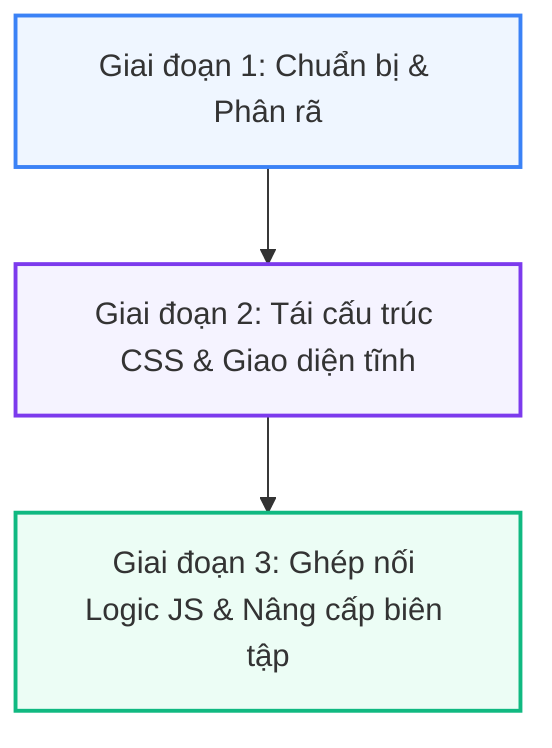

# Đề xuất Cải tiến Giao diện & Trải nghiệm Người dùng (UI/UX Redesign Proposal)

Tài liệu này phân tích cấu trúc giao diện hiện tại của **Novel Translator WebUI (v6.2.0)** và đưa ra đề xuất cải tiến theo hướng tối giản (minimalist), tối ưu màu sắc hài hòa, nâng cao tính rõ ràng, dễ hiểu và tối ưu hóa thao tác người dùng mà không lạm dụng hiệu ứng phức tạp.

---

## 1. Đánh giá Hiện trạng & Điểm nghẽn UI/UX (Bottlenecks)

### 1.1 Hệ màu sắc và Header
- **Hiện tại**: Thanh header màu xanh dương đậm (`#0b3d59`) tạo cảm giác nặng nề (top-heavy) và tương phản quá gắt với phần thân ứng dụng màu xám sáng (`#f1f5f9`).
- **Emoji**: Sử dụng nhiều emoji mặc định (📚, 🖥️, 🔑, 📦, 💬, 🔄) tuy thân thiện nhưng nếu không được đồng bộ hóa về kích thước và màu sắc sẽ tạo cảm giác giao diện chắp vá, giống các công cụ web đời cũ.
- **Thanh Stats (Góc phải)**: Dồn nén quá nhiều thông tin (API Keys, Cache size/count, Project active/archived) vào một khu vực nhỏ, gây nhiễu loạn thị giác.

### 1.2 Cấu trúc Tab lồng ghép (Deep Tab Hierarchy)
- **Hiện tại**: Người dùng phải đi qua 3 tầng Tab để thực hiện thao tác:
  1. *Tầng 1 (Global Nav)*: Dự án / Cấu hình / Chỉ dẫn AI / Công cụ / Nhật ký / Lưu trữ.
  2. *Tầng 2 (Project Tabs)*: Nội dung gốc / Nội dung dịch / Kiểm chính tả / Thông tin / Chỉ dẫn.
  3. *Tầng 3 (Sub-tabs)*: Ví dụ trong tab Thông tin có Hướng dẫn / Mối quan hệ / Thuật ngữ / Tóm tắt.
- **Hệ quả**: Mất nhiều click chuột để di chuyển giữa các chức năng có liên quan chặt chẽ (ví dụ: vừa dịch vừa xem thuật ngữ hoặc chỉnh sửa prompt).

### 1.3 Thiết kế Workspace & Biên tập (Workspace Redundancy)
- **Hiện tại**: Ba tab "Nội dung gốc", "Nội dung dịch" và "Kiểm chính tả" có bố cục hoàn toàn trùng lặp:
  - Một bảng chứa danh sách file chiếm 350px chiều cao (có thể kéo giãn).
  - Một trình soạn thảo song song (Side-by-side Editor) chiếm 420px chiều cao nằm ngay bên dưới.
- **Hệ quả**: Bố cục bị kéo dài theo chiều dọc, người dùng liên tục phải cuộn trang lên xuống (double-scrollbar issue) để vừa chọn file vừa sửa văn bản. Việc sao chép-dán giữa các tab rất thủ công.

### 1.4 Công cụ & Plugin (Manual Path Inputs)
- **Hiện tại**: Tab Plugins (EPUB Converter & OCR) yêu cầu người dùng gõ đường dẫn file thủ công (ví dụ: `workspace/input/novel.epub` hoặc `/path/to/output.txt`).
- **Hệ quả**: Rất dễ gõ sai đường dẫn, trải nghiệm kém thân thiện với người dùng không rành kỹ thuật.

---

## 2. Triết lý Thiết kế Mới (Minimalist & High-Efficiency)

Chúng ta sẽ áp dụng phong cách thiết kế **Modern Minimalist (Tối giản hiện đại)** kết hợp với cấu trúc **Single-Screen Workspace (Không gian làm việc một màn hình)**:
1. **Phẳng hóa & Nhẹ hóa**: Giảm các đường viền (borders) đen gắt, thay bằng độ lệch tông màu nền hoặc đổ bóng siêu nhẹ (subtle shadow).
2. **Hệ màu HHSL (Harmonious HSL)**: Chọn tông màu chủ đạo dễ chịu cho mắt khi làm việc thời gian dài (Slate/Indigo hoặc Slate/Violet).
3. **Ưu tiên sự rõ ràng (Clarity over Motion)**: Không dùng các hiệu ứng chuyển động rườm rà, tập trung vào font chữ (typography), khoảng trắng (white space) và trạng thái nút bấm rõ ràng.

---

## 3. Các Đề xuất Cải tiến Chi tiết

### 3.1 Cải tiến Header & Hệ màu
- **Header**: Chuyển từ màu xanh đậm `#0b3d59` sang **Màu trắng nền nã** hoặc **Xám siêu nhạt** (`#ffffff` hoặc `#f8fafc`) có viền dưới mảnh màu xám (`#e2e8f0`). Chữ chuyển sang màu xám tối (`#1e293b`).
- **Stats Panel**: Gom gọn các chỉ số trạng thái thành một nhóm nhỏ dạng chấm tròn màu (Green/Yellow/Red) thể hiện kết nối, chỉ hiện thông tin chi tiết khi hover chuột (Tooltip).
- **Hệ màu chủ đạo mới**:
  - `Background`: `#f8fafc` (Xám Slate nhạt) tạo cảm giác sạch sẽ.
  - `Card/Container`: `#ffffff` (Trắng tinh khiết).
  - `Accent/Primary`: `#4f46e5` (Indigo - Xanh chàm hiện đại) hoặc `#6366f1` thay cho màu xanh dương thuần.
  - `Text`: `#0f172a` (Slate 900) cho tiêu đề và `#475569` (Slate 600) cho nội dung thường.

### 3.2 Tái cấu trúc Workspace: Mô hình "File Explorer + Unified Editor"
Thay vì chia làm 3 tab riêng biệt với 3 bảng file và 3 editor, chúng ta sẽ gộp chung vào một giao diện chuyên nghiệp giống như VS Code thu nhỏ:

```
+-------------------------------------------------------------------------+
|  📚 Content Translator    [Dự án]   [Cấu hình]   [Chỉ dẫn AI]   [Công cụ]  |
+-------------------------------------------------------------------------+
|  [📂 Dự án: Novel A ]                                                    |
|  +-------------------+-----------------------------------------------+  |
|  | DANH SÁCH FILE    | TRÌNH BIÊN TẬP SONG SONG                      |  |
|  |                   | Chế độ: [Dịch thuật ▾]   [Cuộn đồng bộ: On]   |  |
|  | 📄 Chương 1.txt   | +----------------------+----------------------+  |
|  | 📄 Chương 2.txt   | | BẢN GỐC              | BẢN DỊCH             |  |
|  | 📄 Chương 3.txt   | |                      |                      |  |
|  |                   | |                      |                      |  |
|  | Dịch: [Dịch 🚀]   | |                      |                      |  |
|  | Ghép: [Ghép 🧩]   | |                      |                      |  |
|  +-------------------+-----------------------------------------------+  |
|  | Gợi ý Thuật ngữ:  | 📝 Từ điển nhanh: nhân vật A (lão đại)        |  |
|  +-------------------+-----------------------------------------------+  |
+-------------------------------------------------------------------------+
```

#### Chi tiết giải pháp:
- **Sidebar trái dự án (Project File Tree)**: Rộng 250px, chứa danh sách tất cả các file nguồn và file đã dịch. Hiển thị biểu tượng trạng thái trực quan:
  - 🛑 *Chưa dịch*
  - ⏳ *Đang dịch ngầm*
  - ✅ *Đã dịch xong*
- **Khu vực Editor chính (Right Pane)**:
  - Luôn cố định chiều cao bằng 100% không gian còn lại (viewport-fit), loại bỏ cuộn dọc của cả trang web. Chỉ cuộn bên trong 2 khung Textarea.
  - **Dropdown chọn Chế độ làm việc**:
    - `Dịch thuật`: Hiển thị cột trái (Nguồn) - cột phải (Bản dịch).
    - `Soát lỗi chính tả`: Hiển thị cột trái (Bản dịch) - cột phải (Bản đã soát lỗi AI).
  - **Nút "Cuộn đồng bộ" (Sync Scroll)**: Tự động cuộn khung bên phải khi người dùng cuộn khung bên trái và ngược lại. Rất quan trọng khi đối chiếu chương dài.

### 3.3 Hỗ trợ Trực quan hóa Thuật ngữ (Interactive Glossary)
- **Vấn đề**: Hiện tại người dùng phải click vào tab "Thông tin" -> "Thuật ngữ" để xem danh sách nhân vật/từ điển, sau đó quay lại để dịch.
- **Giải pháp**:
  - Khi mở một file, hệ thống tự động quét các từ khóa trong từ điển (glossary) đang xuất hiện trong cột bản gốc.
  - **Highlight nhẹ** (gạch chân nét đứt màu vàng nhạt `#fef08a`) dưới các từ này.
  - Khi người dùng rê chuột (hover) vào từ được gạch chân, một popup nhỏ xuất hiện ngay tại con trỏ hiển thị nghĩa dịch nghĩa tương ứng.
  - Người dùng có thể click vào từ đó để tự động chèn bản dịch thuật ngữ vào vị trí con trỏ bên cột bản dịch.

### 3.4 Tinh gọn Tab Cấu hình (System Config)
- **Hiện tại**: Cột Gemini và OpenAI hiển thị song song rất dài và rối mắt.
- **Giải pháp**:
  - Thiết kế **Segmented Control** (Nút chuyển đổi trạng thái dạng tab phẳng) ở đầu trang: `[ Google Gemini ]` và `[ OpenAI Compatible ]`.
  - Chỉ hiện khung cấu hình của nhà cung cấp được chọn. Ẩn toàn bộ phần còn lại.
  - **Trường nhập API Keys**: Thay thế Textarea to đùng bằng các ô Input có định dạng ẩn mật khẩu (`type="password"`) đi kèm nút biểu tượng con mắt để ẩn/hiện key. Điều này giúp giao diện gọn gàng và bảo mật hơn khi quay video màn hình.
  - **Thanh kéo Temperature**: Thiết kế tối giản với thanh trượt mượt mà, ghi chú rõ ràng ở 2 đầu: `Chính xác, nhất quán (0.0)` <---> `Sáng tạo, bay bổng (1.0+)`.

### 3.5 Cải tiến Tab Chỉ dẫn AI (Prompts)
- **Tách biệt hiển thị**: Danh sách thể loại (Sidebar) được thu nhỏ và tối giản.
- **Gợi ý Placeholder thông minh**: Thay vì hiển thị danh sách placeholder `{source_text}`, `{glossary}` ở một khối tĩnh chiếm diện tích phía dưới, hãy thiết kế nó thành một **Floating Sidebar Panel (Bảng trợ giúp nổi)** ở góc phải màn hình, có thể ẩn/hiện bằng một nút bấm 💡.
- **Khôi phục nhanh**: Thêm nút "Reset" nhỏ bên cạnh từng Textarea prompt (ví dụ: chỉ reset prompt Tóm tắt về mặc định hệ thống mà không ảnh hưởng đến prompt Dịch thuật).

### 3.6 Trải nghiệm thao tác Plugin (EPUB/OCR) thân thiện
- **Loại bỏ nhập Path thủ công**:
  - Tại ô "Đường dẫn file EPUB" và "Đường dẫn file PDF/Ảnh", thêm nút **"Chọn File" (Browse File)** mở ra một hộp thoại Explorer mini hiển thị danh sách các file đang có trong thư mục `workspace/input/` hoặc cho phép tải file mới lên trực tiếp.
  - Tích hợp vùng **Drag and Drop (Kéo và thả file)**: Người dùng kéo file EPUB/PDF thả trực tiếp vào ô cấu hình, hệ thống tự động nhận diện và điền đường dẫn.
- **Log Terminal**: Khung hiển thị log chạy ngầm thiết kế bo góc, chữ Courier New mảnh, có nút "Clear Log" và tự động cuộn xuống cuối (Auto-scroll to bottom) khi có dòng log mới.

### 3.7 Nâng cấp Trải nghiệm Modals (Hộp thoại)
- Thay thế các Modal to lớn, chắn giữa màn hình bằng **Slide-over Panels (Bảng trượt từ cạnh phải)**:
  - Khi nhấn "⚙️ Thông tin" dự án hoặc xem "Nhật ký tiến trình dịch thuật", một bảng điều khiển sẽ trượt mượt mà từ cạnh phải màn hình ra (chiếm khoảng 30% - 40% chiều rộng).
  - Người dùng vẫn có thể nhìn thấy nội dung Workspace ở bên trái, giúp giữ nguyên ngữ cảnh làm việc (Context Preservation) thay vì bị chặn hoàn toàn bởi một tấm che màu đen (backdrop).

---

## 4. Kế hoạch Thực hiện Đề xuất (Redesign Roadmap)

Do người dùng yêu cầu **không viết code ở bước này**, chúng tôi đề xuất lộ trình triển khai gồm 3 giai đoạn sau để chuẩn bị cho việc lập trình sau này:



### Giai đoạn 1: Chuẩn bị & Phân rã (Preparation)
1. **Phân rã file `main.js`**: File JavaScript hiện tại có dung lượng lên đến 139KB (gần 3000 dòng code hỗn hợp). Việc này cần được tách thành các module nhỏ hơn (ví dụ: `projectManager.js`, `editor.js`, `apiConfig.js`, `plugins.js`) để dễ bảo trì và tránh xung đột khi nâng cấp UI.
2. **Thiết lập Figma/Mockup (Nếu cần)**: Phác thảo bố cục lưới (Grid Layout) để chuẩn bị CSS.

### Giai đoạn 2: Tái cấu trúc CSS & Giao diện tĩnh (Refactoring CSS & Static Markup)
1. **Thiết lập CSS Variables mới**: Định nghĩa lại hệ màu tối giản, font chữ và các khoảng đệm (padding/margin) trong `static/css/style.css`.
2. **Cải tiến Header & Sidebar**: Thay đổi markup HTML trong `header.html` và `tab_workspace.html` để tạo khung Sidebar File Tree.
3. **Thiết kế Unified Editor**: Sắp xếp lại bố cục Flexbox/Grid của trình soạn thảo để cố định chiều cao màn hình.

### Giai đoạn 3: Ghép nối Logic JS & Nâng cấp Biên tập (JS Logic Integration)
1. **Tích hợp logic cho Unified Editor**: Kết nối danh sách file ở Sidebar với trình soạn thảo. Khi click vào file, tự động tải nội dung và chuyển đổi chế độ hiển thị phù hợp.
2. **Tích hợp tính năng phụ trợ**: Viết logic đồng bộ cuộn (Sync Scroll) và logic quét highlight thuật ngữ từ điển trong văn bản gốc.
3. **Cải tiến các ô nhập cấu hình & kéo thả file**: Thay thế các ô nhập đường dẫn bằng bộ chọn file trực quan.
