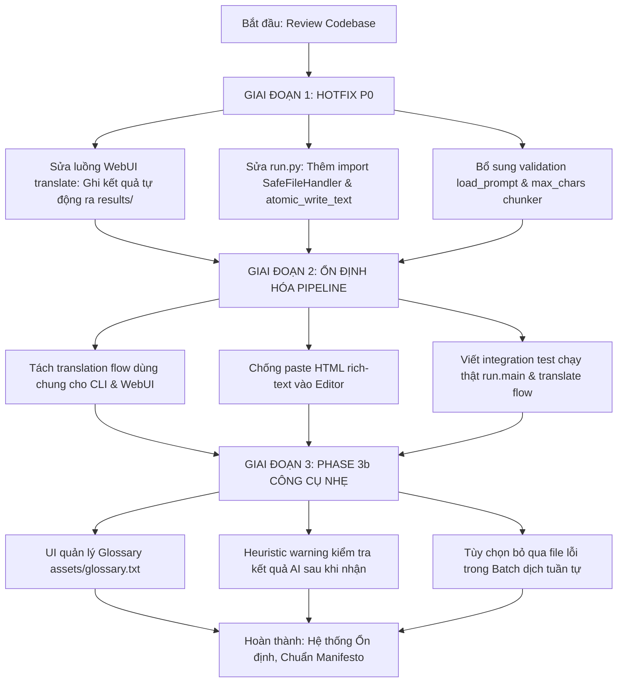

# BÁO CÁO REVIEW TOÀN DIỆN MÃ NGUỒN & ĐỀ XUẤT TỐI ƯU HÓA DỰ ÁN

> **Dự án:** Content Translator (Next-Gen)  
> **Phiên bản mã nguồn:** v3.0.0 (Branch: `phase-2.5` / Phase 3a in-progress)  
> **Tài liệu tham chiếu chuẩn cao nhất:** `docs/00_PROJECT_MANIFESTO.md` (v2.5)  
> **Ngày lập báo cáo:** 05/09/2026  
> **Người thực hiện:** Antigravity AI (Pair Programming Reviewer)  
> **Tệp lưu trữ:** `docs/wip/2026-09-05_BAO_CAO_REVIEW_TOAN_DIEN_VA_DE_XUAT_TOI_UU.md`  

---

## 1. TỔNG QUAN & MỤC TIÊU ĐÁNH GIÁ

Báo cáo này được thực hiện nhằm rà soát toàn bộ tài liệu đặc tả trong thư mục `docs/` và toàn bộ mã nguồn (`core/`, `web/`, `main.py`, `run.py`, `tests/`) của dự án **Content Translator**.

### Mục tiêu cốt lõi:
1. **Đối chiếu sự tuân thủ tuyệt đối với Bản Tuyên Ngôn Cốt Lõi (`docs/00_PROJECT_MANIFESTO.md`)**: Xác định rõ dự án có đang đi chệch bản chất "công cụ gửi nhận AI tối giản cho một người dùng" hay không.
2. **Phát hiện lỗi kỹ thuật thực tế (Bug Audit)**: Nhận diện các lỗi nghiêm trọng (P0/P1) có thể làm rơi rụng dữ liệu, vỡ chu trình gửi-nhận hoặc gây crash runtime.
3. **Đánh giá chất lượng thiết kế & kiến trúc**: Đo lường sự phân tách trách nhiệm, tính an toàn file system, concurrency, xử lý lỗi và độ tin cậy của kiểm thử.
4. **Sát hạch tính năng (Litmus Test)**: Thẩm định toàn bộ backlog của Phase 3b/3c/4 để loại bỏ các tính năng gây phình trạng thái (bloatware), chỉ giữ lại những gì phục vụ trực tiếp cho việc gửi chunk và nhận bản dịch nhanh hơn, nhẹ hơn.
5. **Kế hoạch hành động cụ thể**: Đưa ra lộ trình sửa chữa tối thiểu và nâng cấp an toàn.

---

## 2. ĐỐI CHIẾU VỚI TÔN CHỈ DỰ ÁN (`00_PROJECT_MANIFESTO.md`)

| Tiêu chí Tuyên ngôn | Hiện trạng Mã nguồn | Đánh giá | Chi tiết đối chiếu |
|---|---|:---:|---|
| **Bản chất cốt lõi (§1)**<br>*Chỉ gửi chunk và nhận dịch, 1 user local* | CLI + WebUI 3 cột, SQLite index/log nhẹ, không có tài khoản/auth, không đa người dùng | **ĐẠT** | Dự án giữ vững tính chất single-user local. Chưa bị biến thành hệ thống SaaS hay CAT tool phức tạp. |
| **Chu trình gửi-nhận (§1)**<br>*Chọn nguồn → Chia chunk → Dựng prompt → Gửi tuần tự → Ghép `\n\n` → Ghi file* | CLI và WebUI Merge tuân thủ; **WebUI Single-file vi phạm nghiêm trọng** | **KHÔNG ĐẠT (P0)** | `_handle_translate_sse` dịch xong các chunk nhưng **không ghi ra file `results/`**, để status là `translating`, nhưng lại log `ok`. |
| **Nguyên tắc thất bại (§3)**<br>*Dừng ngay khi lỗi, không resume, không checkpoint dở dang* | Không có bảng `checkpoints`, gặp lỗi dừng cả phiên, chạy lại từ đầu | **ĐẠT** | Rất kiên định, không mang vác hệ thống checkpoint/state machine phức tạp. |
| **Provider / Model (§6)**<br>*Explicit, không fallback ngầm, `providers.json` là SSOT* | Dropdown explicit, `KeyRotator` xoay key khi 429, không tự đổi model | **ĐẠT** | Quản lý provider qua `AIProviderManager` tốt, hỗ trợ Gemini thinking levels chuẩn. |
| **Bảo mật Local (§7)**<br>*Full key trên UI, không mã hóa lúc nghỉ, bảo vệ chống public* | UI hiện full key, `.gitignore` có `providers.json`, `keys.json`, `workspace/` | **ĐẠT** | Không bị sa đà vào các cơ chế bảo mật thừa thãi cho app nội bộ. |
| **Chính sách Kỹ thuật (§9)**<br>*Zero build-step, zero-npm, vanilla JS/CSS, stdlib + httpx* | Backend: stdlib + `httpx`. Frontend: tách tĩnh `css/app.css` + `js/*.js` thuần | **ĐẠT XUẤT SẮC** | Hoàn toàn offline, nạp cực nhanh, không phụ thuộc CDN hay npm package nào. |
| **Khởi động lại Server (§9)**<br>*Dùng `os.execv` với đường dẫn script tuyệt đối* | Đã triển khai `_restart_args()` absolutize script path + test kiểm chứng | **ĐẠT** | Giải quyết triệt để lỗi server chết lặng dưới `uv run` hoặc virtualenv. |

---

## 3. PHÁT HIỆN LỖI NGHIÊM TRỌNG (BUGS & ARCHITECTURAL RISKS)

### 🔴 MỨC ĐỘ P0 — PHẢI SỬA NGAY (BLOCKING / DATA INTEGRITY)

#### P0.1. Luồng WebUI Dịch Đơn File (`/api/translate`) BỎ RƠI KẾT QUẢ, Không Ghi Ra File!
- **Vị trí:** `main.py`, hàm `_handle_translate_sse()` (dòng 953–958):
  ```python
  outs = asyncio.run(_run_chunks(client, prompts, [[fname]] * len(prompts),
                                 cfg.get("api_delay_seconds", 2.0), len(keys), emit,
                                 cancel=_cancel_event))
  _upsert_file(project, fname, len(text), len(chunks), "translating")
  log_run(provider["id"], model, "ok", file_id=_file_id(project, fname))
  emit("done", {"chars": sum(len(o) for o in outs)})
  ```
- **Hậu quả:** 
  1. AI dịch thành công tất cả chunk, tiêu tốn quota/tiền API, nhưng server **hoàn toàn không gọi `fh.save_output(project, fname, ...)`**.
  2. File kết quả trong `workspace/projects/{slug}/results/{fname}` **không được tạo ra**.
  3. Trạng thái file trong SQLite bị gán chết là `"translating"` thay vì `"done"`.
  4. Lịch sử `runs` lại ghi nhận là `"ok"`.
  5. Trình duyệt nhận SSE `done` và hiển thị chữ lên editor, nhưng nếu người dùng không tự tay bấm nút Save icon (hoặc đóng tab, mất điện), toàn bộ bản dịch **bị mất vĩnh viễn**!
- **Sự thiếu nhất quán kỳ lạ:** Trong khi đó, luồng gộp file `_handle_merge_sse()` (dòng 1039–1043) lại tự động ghi từng file qua `fh.save_output()` và cập nhật trạng thái `"done"`.
- **Cách khắc phục chuẩn:**
  ```python
  output_content = "\n\n".join(outs)
  fh.save_output(project, fname, output_content)
  _upsert_file(project, fname, len(output_content), len(chunks), "done")
  log_run(provider["id"], model, "ok", file_id=_file_id(project, fname))
  emit("done", {"chars": len(output_content), "saved": True})
  ```

---

#### P0.2. `run.py` Thiếu Import Biểu Tượng Cốt Lõi — Gây `NameError` Khi Chạy CLI
- **Vị trí:** `run.py`, các dòng:
  - Dòng 81: `handler = SafeFileHandler()`
  - Dòng 138: `atomic_write_text(output_path, "\n\n".join(out_chunks))`
- **Hiện trạng:** Phần đầu file `run.py` (dòng 8–15) chỉ import:
  ```python
  from core.ai_client import GeminiClient
  from core.app_db import log_run
  from core.chunker import split_text
  from core.config import AppConfig
  from core.key_rotator import KeyRotator
  from core.openai_client import OpenAICompatClient
  from core.prompt_engine import PromptEngine
  from core.provider_manager import AIProviderManager
  ```
  **HOÀN TOÀN THIẾU `SafeFileHandler` và `atomic_write_text`!**
- **Hậu quả:** Bất kỳ ai chạy `python run.py --project ... --file ...` hoặc chạy dịch trực tiếp đều sẽ bị sập chương trình ngay lập tức với lỗi:
  `NameError: name 'SafeFileHandler' is not defined` hoặc `NameError: name 'atomic_write_text' is not defined`.
- **Nguyên nhân lọt lưới:** Bộ test hiện tại chỉ test các hàm đơn lẻ, **chưa hề có integration test thực thi hàm `run.main()`**.
- **Cách khắc phục:** Thêm import vào `run.py`:
  ```python
  from core.file_handler import SafeFileHandler, atomic_write_text
  ```

---

#### P0.3. Ghi Log `runs` Thành Công Sai Thời Điểm & Kích Thước File Giả Định
- **Vấn đề 1:** Trong cả `run.py` và `main.py`, việc log trạng thái `runs` cần phải nằm **sau** bước ghi file atomic thành công. Nếu quá trình ghi đĩa thất bại (đầy đĩa, lỗi phân quyền), run phải được log là `error`, không thể là `ok`.
- **Vấn đề 2:** Trong `main.py`, hàm `_upsert_file()` đang tính toán kích thước:
  ```python
  size = len(filename.encode("utf-8")) + chars  # ước lượng nhẹ, khỏi stat thêm
  ```
  Đây là một phép tính không có ý nghĩa kỹ thuật (`độ dài tên file + số ký tự`). Sau khi file đã được ghi atomic xuống đĩa, ta hoàn toàn có thể lấy `Path.stat().st_size` hoặc dùng `len(content.encode('utf-8'))` một cách chính xác mà không tốn chi phí.

---

### 🟠 MỨC ĐỘ P1 — RỦI RO KIẾN TRÚC & TÍNH ỔN ĐỊNH (STABILIZATION)

#### P1.1. `main.py` Đang Là Một "God Module" (1070 dòng) Gánh Quá Nhiều Trách Nhiệm
- **Hiện trạng:** `main.py` cùng lúc đảm nhận:
  1. Khởi tạo HTTP Server & Static File Server (MIME mapping).
  2. Định tuyến API thủ công bằng chuỗi `if/elif`.
  3. Thao tác database SQL trực tiếp (`projects`, `files`, `runs`).
  4. Quản lý đồng bộ: `_translate_lock`, `_active_job`, `_cancel_event`.
  5. Ghép nối chuỗi prompt, glossary filtering (`_glossary_for_chunk`).
  6. Thuật toán phân tách marker `===== FILE: ... =====` (`_split_marked`, `_split_output`, `_attribute`).
  7. Logic đổi tên hàng loạt (`rename-batch`) và tìm/thay thế regex trên thư mục (`find-replace`).
  8. Streaming SSE và quản trị tiến trình.
- **Rủi ro:** Mã nguồn bị thắt nút cổ chai; logic nghiệp vụ dịch bị phân tán giữa `main.py` và `run.py`. Bất kỳ sửa đổi nhỏ nào về routing cũng có thể làm chập chờn luồng dịch.
- **Đề xuất tái cấu trúc tối giản (Zero-framework):**
  Không cần thêm FastAPI hay Flask. Chỉ cần tách `main.py` thành 3 module thuần Python:
  - `core/translation_flow.py`: Chứa toàn bộ logic dựng prompt, chạy chunk, gộp kết quả, lưu file và ghi DB (dùng chung 100% cho cả `run.py`, WebUI single và WebUI merge).
  - `core/marker_merger.py`: Chứa các hàm pure-logic `_split_marked`, `_split_output`, `_attribute`.
  - `main.py`: Giữ lại vai trò thuần túy là Dispatcher (HTTP Server, parse request, gọi service, trả JSON/SSE).

---

#### P1.2. Phân Tách Giữa Các Ngoại Lệ Client và Error Taxonomy
- `core/errors.py` định nghĩa rất tốt taxonomy: `"rotate" | "retry_same" | "fatal"`.
- Tuy nhiên, trong `GeminiClient` và `OpenAICompatClient`, khi gặp lỗi, chúng lại bắn ra các exception tiêu chuẩn như `RuntimeError`, `ValueError`, `ConnectionError`, `TimeoutError` với chuỗi message thô.
- Điều này khiến `main.py` và `run.py` phải `except` hàng loạt lỗi và chỉ đọc chuỗi string, làm mất toàn bộ cấu trúc lỗi (HTTP status, attempt count, key index) phục vụ cho giao diện và debug.

---

#### P1.3. Lỗ Hổng Kiểm Tra Đường Dẫn Tại `PromptEngine.load_prompt()`
- Trong `core/prompt_engine.py`:
  - `delete_prompt()` và `rename_prompt()` đều gọi `self._check_name(name)` để chặn path traversal `..` và ký tự `/`.
  - Nhưng `load_prompt(prompt_filename)` lại **KHÔNG gọi `_check_name()`**:
    ```python
    def load_prompt(self, prompt_filename: str = "default_translation.txt") -> str:
        file_path = self.prompts_dir / prompt_filename
        if not file_path.exists(): ...
    ```
  - Mặc dù HTTP handler trong `main.py` có kiểm tra chuỗi, nhưng nếu bất kỳ module nào khác gọi trực tiếp `load_prompt()`, nguyên tắc "Defense in Depth" bị phá vỡ.
- **Cách khắc phục:** Luôn gọi `name = self._check_name(prompt_filename)` ngay dòng đầu tiên của `load_prompt()`.

---

#### P1.4. `split_text()` Thiếu Kiểm Tra Biên `max_chars <= 0`
- Trong `core/chunker.py`, nếu tham số `max_chars` bị truyền vào `<= 0` (do lỗi cấu hình hoặc caller ngoài), điều kiện `len(text) <= max_chars` sẽ luôn `False`, dẫn đến việc đệ quy phân đôi văn bản vô tận cho đến khi sập với `RecursionError`.
- **Cách khắc phục:** Thêm guard clause:
  ```python
  if max_chars <= 0:
      raise ValueError(f"max_chunk_chars phải lớn hơn 0, nhận được: {max_chars}")
  ```

---

#### P1.5. Editor `<div contenteditable="true">` Dễ Dính Rác Rich Text Khi Paste
- Cột kết quả (`tOut`) trên giao diện đang dùng thẻ `<div contenteditable="true">`.
- Khi người dùng copy nội dung từ nguồn ngoài hoặc dán văn bản có định dạng, trình duyệt sẽ chèn các thẻ HTML inline (`<span style="...">`, `<br>`, `<b>`). Khi bấm Lưu, `tOut.textContent` có thể bị sai lệch dòng hoặc mất định dạng khoảng trắng gốc.
- **Đề xuất:** Hoặc chuyển sang dùng `<textarea id="tOut" class="pane">` (nhất quán với `prBody`), hoặc lắng nghe sự kiện `paste` và chỉ chèn plain-text:
  ```javascript
  $('tOut').addEventListener('paste', e => {
      e.preventDefault();
      const text = (e.clipboardData || window.clipboardData).getData('text/plain');
      document.execCommand('insertText', false, text);
  });
  ```

---

### 🟡 MỨC ĐỘ P2 — CẢI TIẾN CHẤT LƯỢNG & KIỂM THỬ (CODE SMELLS & TESTING)

1. **Bộ test `tests/test_server.py` gặp lỗi mạng sandbox:**
   - Trong môi trường sandbox (không có bypass network), việc test server thật thông qua `urllib.request.urlopen("http://127.0.0.1:...")` bị intercept bởi proxy nội bộ và bắn lỗi `Direct IP access is not allowed` hoặc `PermissionError: Operation not permitted`.
   - Cần cấu hình biến môi trường `no_proxy=127.0.0.1,localhost` chuẩn trong cấu hình pytest (`pytest.ini` hoặc fixture) để bộ test tự động pass trơn tru ở mọi môi trường.
2. **Thiếu Integration Test End-to-End:**
   - Cần bổ sung test chạy hàm `main()` của `run.py` với Mock AI Server để đảm bảo không bao giờ tái diễn lỗi thiếu import như P0.2.
   - Bổ sung test kiểm tra sau khi gọi `/api/translate`, file vật lý trong `results/` phải tồn tại với nội dung đầy đủ.
3. **Cảnh báo lỗi trong `KeyRotator` dùng tên file cũ:**
   - `core/key_rotator.py` dòng 21 ghi: `Vui lòng nạp key vào config/keys.json`. Cần sửa thành `config/providers.json` để đồng nhất với SSOT.

---

## 4. ĐÁNH GIÁ CHI TIẾT TỪNG THÀNH PHẦN MÃ NGUỒN

### 4.1. Tầng Lõi Dịch Thuật (`core/`)

#### Chunker (`core/chunker.py`)
- **Ưu điểm:** Thuật toán `_find_best_cut` xử lý rất khéo léo theo thứ tự ưu tiên: ngắt đoạn `\n\n` $\to$ ngắt dòng `\n` $\to$ ngắt câu $\to$ ngắt từ. Giữ trọn vẹn nội dung có ý nghĩa.
- **Điểm cần lưu ý:** Thuật toán đệ quy chia đôi (50%) quanh dải 20%–80%. Khi file dài 100k ký tự với `max_chars = 16000`, nó sẽ chia 50k $\to$ 25k $\to$ 12.5k, tạo ra các chunk xấp xỉ 12.5k thay vì tận dụng tối đa 16k. Đây là sự đánh đổi chấp nhận được để giữ ranh giới tự nhiên, hoàn toàn phù hợp với Manifesto §4.

#### Prompt Engine (`core/prompt_engine.py`)
- **Ưu điểm:** Đơn giản, dùng UTF-8 chuẩn xác, hỗ trợ thay thế linh hoạt cả `{{source_text}}` và `{{glossary_terms}}`.
- **Điểm hoàn thiện:** Bổ sung validation tên file trong `load_prompt()`.

#### AI Clients (`core/ai_client.py` & `core/openai_client.py`)
- **Ưu điểm:** Tuyệt đối không dùng SDK bên thứ ba, chỉ dùng `httpx` REST thuần. Xử lý timeout, retry cùng key khi gặp mã 5xx/mất mạng, và xoay key ngay khi gặp 429.
- **Cơ chế Hủy (`_post_or_abort`):** Cơ chế dùng `asyncio.create_task` kết hợp cờ `abort.is_set()` là một giải pháp thông minh cho local app. Tuy nhiên, cần bọc thêm việc đợi task huỷ kết thúc để tránh cảnh báo rác của Python loop.

#### File Handler & An toàn Đường dẫn (`core/file_handler.py` & `core/fileops.py`)
- **Ưu điểm xuất sắc:**
  - `guard_name()` chuẩn hóa Unicode NFC, loại bỏ triệt để nguy cơ Path Traversal (`..`, `/`, `\`).
  - `atomic_write_text()` sử dụng cơ chế ghi file tạm `.tmp` cùng thư mục + `fsync` + `os.replace` nguyên tử, bảo vệ dữ liệu 100% khi xảy ra crash.
  - `write_bytes_no_overwrite()` dùng cờ `xb` chống race condition khi upload trùng tên.
  - Tự động di chuyển an toàn thư mục cũ `translated/` sang `results/`.

#### Quản lý Cấu hình & Nhà cung cấp (`core/provider_manager.py` & `core/config.py`)
- **Ưu điểm:**
  - `config/providers.json` là SSOT duy nhất, có cache danh sách model 5 phút, fallback model khi offline.
  - Hỗ trợ metadata model, thinking levels (chỉ bật cho Gemini, bỏ qua cho OpenAI), và kiểm tra namespace model khi người dùng nhập thủ công.

---

### 4.2. Tầng Giao Diện WebUI (`web/`)

#### Cấu trúc Tách Tĩnh (Zero-Build Frontend)
Dự án đã hoàn thành xuất sắc việc phân tách `index.html` (trước đây 482 dòng) thành kiến trúc mô-đun hoá tĩnh:
```text
web/
├── css/
│   └── app.css          (Design tokens, layout fluid, typography, responsive)
├── js/
│   ├── app.js           (Helpers $, J, esc, sidebar, remember tab)
│   ├── projects.js      (Quản lý cards dự án, lịch sử chạy)
│   ├── workspace.js     (Bảng điều khiển 3 cột, SSE translator, dropzone, editor)
│   ├── findreplace.js   (Thanh công cụ Sigil-like regex find/replace)
│   ├── prompts.js       (Quản lý mẫu prompt)
│   ├── settings.js      (Cấu hình nhà cung cấp, model, api keys, prefs)
│   └── init.js          (Trình tự khởi động ứng dụng)
└── index.html           (Markup khung sườn ngữ nghĩa)
```
- **Đánh giá:** Rất sạch sẽ, tải trang ngay tức thì. Không cần Webpack, Vite hay NPM. Hoàn toàn đúng tôn chỉ Manifesto §9.
- **Điểm cần lưu ý:** Vì nạp các file JS dạng `<script defer>` dùng chung phạm vi toàn cục, cần cẩn trọng tránh xung đột tên biến toàn cục giữa các file.

---

## 5. Ý KIẾN CHUYÊN GIA & ĐỀ XUẤT ĐIỀU CHỈNH TÍNH NĂNG

### 5.1. Nhìn Nhận Thẳng Thắn: Tránh Bẫy "Feature Creep" (Phình Tính Năng)

Dự án đang đứng trước lằn ranh quan trọng giữa **"Công cụ gửi nhận dịch AI tối giản, tin cậy"** và **"Phần mềm biên tập tiểu thuyết đa năng nhưng cồng kềnh"**.

Hãy nhớ lại câu hỏi sát hạch tối thượng tại **§5 của Bản Tuyên Ngôn**:
> **"Tính năng này có giúp việc gửi chunk cho AI và nhận bản dịch về nhanh hơn, nhẹ hơn không?"**  
> *Nếu làm tăng trạng thái, thêm luồng ngầm, hoặc không phục vụ trực tiếp chu trình gửi-nhận: LOẠI BỎ NGAY LẬP TỨC.*

---

### 5.2. Sát Hạch Toàn Bộ Backlog (Phase 3b / 3c / 4 / 5) Theo Manifesto

| Tính năng trong Kế hoạch | Sát hạch Manifesto (§5) | Đánh giá & Khuyến nghị |
|---|:---:|---|
| **1. Tự động lưu bản dịch WebUI đơn file** | **VƯỢT QUA (BẮT BUỘC)** | Đây không phải tính năng mới, đây là **sửa lỗi vi phạm chu trình cốt lõi**. Phải làm ngay. |
| **2. Bổ sung import cho `run.py`** | **VƯỢT QUA (BẮT BUỘC)** | Sửa lỗi hỏng CLI. Phải làm ngay. |
| **3. Glossary theo dự án (`assets/glossary.txt`)** | **VƯỢT QUA** | **NÊN LÀM (Phase 3b):** Backend đã có hàm `_glossary_for_chunk()`. Chỉ cần thêm 1 tab/dialog nhỏ để sửa file text `gốc=nghĩa`. Tính năng này trực tiếp làm bản dịch AI chuẩn xác hơn mà không tăng độ phức tạp hệ thống. |
| **4. Cảnh báo Heuristic bất thường**<br>*(Độ dài tụt 50%, rỗng, lặp từ, đứt câu)* | **VƯỢT QUA** | **NÊN LÀM (Phase 3b):** Giúp người dùng phát hiện ngay chunk lỗi mà **không cần gọi thêm model AI thứ hai để chấm điểm**. Chỉ là phép so sánh độ dài và regex nhẹ ở server. |
| **5. Tùy chọn "Bỏ qua file lỗi" khi Dịch Hàng Loạt** | **VƯỢT QUA** | **NÊN LÀM (Phase 3c):** Khi dịch tuần tự 20 chương truyện qua đêm, nếu gặp 1 chương lỗi mạng, việc có checkbox cho phép ghi nhận lỗi và tiếp tục các chương sau là cực kỳ giá trị cho người dùng đơn lẻ. |
| **6. Prompt Profile JSON phức tạp** | **KHÔNG VƯỢT QUA** | **NÊN TINH GIẢN:** Không nên xây dựng hệ thống profile engine động. Hiện tại dự án đã có `wPrompt` (chọn template chính) và `wExtra` (chọn thêm prompt bổ sung). Chỉ cần lưu danh sách checkbox được tick vào `localStorage` là đủ, không cần thêm cấu trúc JSON mới. |
| **7. CodeMirror 6 / Monaco Editor** | **KHÔNG VƯỢT QUA** | **CẤM THEO §9:** Quá nặng (>500KB), vướng build step, hay gây lỗi gõ tiếng Việt (Telex/VNI). Textarea hoặc Contenteditable bọc plain-text là đủ cho nhu cầu xem và sửa nhanh. |
| **8. Preview Markdown / HTML thời gian thực** | **CÂN NHẮC / LÀM NHẸ** | Chỉ nên dùng khi người dùng chủ động bấm nút "Xem thử" (dùng `marked.min.js` vendor 1 file). Tuyệt đối không làm pane thứ 3 render liên tục gây giật lag giao diện. |
| **9. Đóng gói EPUB (`tools/epub_tool.py`)** | **VƯỢT QUA (Độc lập)** | Giữ đúng nguyên tắc §2.C và Phase 4: Làm thành một tool CLI độc lập chạy ngoài (`python tools/epub_tool.py`), **không nhúng sâu vào lõi gửi-nhận**. |
| **10. Checkpoint lưu tạm từng chunk** | **LOẠI BỎ THEO §3** | Tiếp tục giữ vững nguyên tắc: **Không checkpoint chunk**. Khi lỗi, chạy lại từ chunk đầu. Vì mỗi file chỉ 2-3 chunk, việc chạy lại chỉ tốn vài chục giây, không đáng để duy trì state machine phức tạp. |

---

## 6. KẾ HOẠCH HÀNH ĐỘNG ĐỀ XUẤT (ACTIONABLE REMEDIATION PLAN)



### Giai Đoạn 1: Sửa Chữa Ngay Lập Tức (Hotfix P0 — Ngay trong hôm nay)
1. **Sửa `main.py` (`_handle_translate_sse`)**:
   - Thêm bước ghi đĩa: `fh.save_output(project, fname, "\n\n".join(outs))` ngay sau khi vòng lặp chunks hoàn tất.
   - Chuyển trạng thái file: `_upsert_file(project, fname, len(output), len(chunks), "done")`.
   - Ghi log `runs` với trạng thái `ok`.
2. **Sửa `run.py`**:
   - Thêm `from core.file_handler import SafeFileHandler, atomic_write_text`.
3. **Bảo vệ phòng thủ (Defensive Code)**:
   - Thêm `self._check_name(prompt_filename)` vào `PromptEngine.load_prompt()`.
   - Thêm kiểm tra `max_chars > 0` trong `core/chunker.py`.
   - Sửa thông báo lỗi `config/keys.json` thành `config/providers.json` trong `KeyRotator`.

### Giai Đoạn 2: Ổn Định Hóa (Stabilization — 1-2 ngày)
1. **Thống nhất Pipeline Dịch Thuật**:
   - Đưa logic thực thi vòng lặp gửi chunk về một hàm chung: `run_translation_pipeline(...)`. Cả `run.py`, WebUI single và WebUI merge đều dùng chung hàm này để tránh lệch pha hành vi.
2. **Khắc phục Editor Contenteditable**:
   - Bắt sự kiện `paste` trên `tOut` để chỉ chèn plain-text, ngăn chặn hoàn toàn rác HTML.
3. **Hoàn thiện Bộ Test**:
   - Viết unit/integration test độc lập cho `run.py`.
   - Cấu hình biến môi trường kiểm thử để 100% test trong `tests/` pass trơn tru mà không vướng sandbox proxy.

### Giai Đoạn 3: Triển Khai Tính Năng Nhẹ Hữu Ích (Phase 3b / 3c)
1. **UI Glossary trực quan**: Cho phép thêm bớt thuật ngữ dịch trong `workspace/projects/{slug}/assets/glossary.txt`.
2. **Heuristic Warnings**: Cảnh báo tức thì nếu AI trả về bản dịch bất thường (rỗng, ngắn hơn nguồn 50%, bị lặp từ).
3. **Cải tiến Batch Dịch tuần tự**: Thêm tùy chọn tiếp tục file tiếp theo nếu gặp file lỗi, in tiến độ tổng thể.

---

## 7. KẾT LUẬN

Dự án **Content Translator** sở hữu một nền tảng kiến trúc rất lành mạnh và đáng khen ngợi:
- **Tư duy kỹ thuật đúng đắn**: Dùng stdlib + httpx, zero-SDK, zero-npm, local-first, không làm màu, tôn trọng quyền riêng tư tuyệt đối của người dùng.
- **Tầng an toàn file xuất sắc**: Chống path traversal, ghi file atomic và cơ chế xoay key xử lý 429 rất bài bản.

Tuy nhiên, việc vấp phải lỗi P0 (không ghi output ở WebUI đơn file và thiếu import ở `run.py`) là dấu hiệu cho thấy **hệ thống đang thiếu các integration test xuyên suốt** và **tập tin `main.py` đang phình to quá nhanh**.

**Khuyến nghị:** Hãy tạm dừng việc mở rộng thêm các tính năng mới của Phase 3b/4. Hãy dành trọn vẹn phiên làm việc tiếp theo để thực hiện **Giai đoạn 1 (Hotfix P0)** và **Giai đoạn 2 (Ổn định hóa Pipeline)** theo đúng báo cáo này. Khi chu trình gửi-nhận cốt lõi đã đạt độ tin cậy 100%, việc bổ sung thêm Glossary hay Batch Tool sẽ diễn ra vô cùng nhẹ nhàng, an toàn và bền vững.
