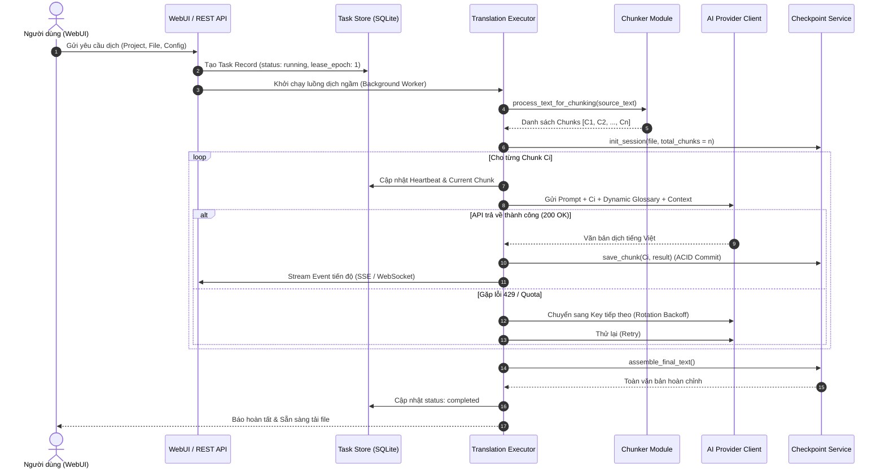
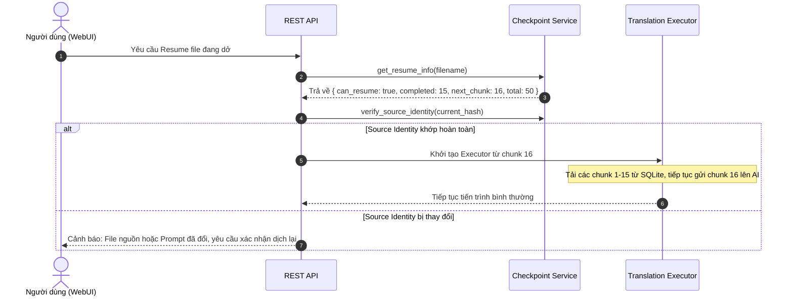

# BÁO CÁO TOÀN DIỆN HỆ THỐNG NOVEL-TRANSLATOR
> **Tài liệu đặc tả kiến trúc, logic, giải thuật và luồng thực thi (System Blueprint & Technical Specification)**  
> *Được trích xuất và tổng hợp từ GitNexus Knowledge Graph (184 files, 6.797 symbols, 16.155 relations, 234 flows) phục vụ xây dựng hệ thống mới từ con số 0.*

---

## 1. TỔNG QUAN DỰ ÁN & MỤC TIÊU HỆ THỐNG

**Novel-Translator (AI Content Translator)** là hệ thống dịch thuật và biên tập tiểu thuyết/sách thông minh, giải quyết triệt để các vấn đề của các công cụ dịch thông thường:
1. **Xử lý tài liệu siêu dài**: Hàng trăm chương, hàng triệu từ mà không bị mất ngữ cảnh hay tràn token context.
2. **Tính nhất quán cao (Consistency)**: Tự động trích xuất và áp dụng bảng thuật ngữ (Glossary), tên nhân vật, địa danh, xưng hô và bộ nhớ dịch (Translation Memory).
3. **Độ tin cậy & Chống đứt gãy (High Resiliency)**: Cơ chế lưu Checkpoint theo từng phân đoạn (Chunk), hỗ trợ tiếp tục (Resume) sau sự cố crash/mất mạng, cơ chế khóa worker an toàn (Fencing token) chống ghi đè dữ liệu.
4. **Hạ tầng AI linh hoạt & Chi phí tối ưu**: Xoay vòng hàng loạt API key (Google Gemini, OpenAI, Claude, DeepSeek, Local Ollama), quản lý Rate Limit (RPM/RPD) thông minh và tự động chuyển hướng khi lỗi (Failover).

---

## 2. BẢN ĐỒ TÍNH NĂNG TOÀN DIỆN (FEATURE MATRIX)

```
┌──────────────────────────────────────────────────────────────────────────────────┐
│                            NOVEL-TRANSLATOR PLATFORM                             │
├───────────────────┬───────────────────┬───────────────────┬──────────────────────┤
│ 1. DỊCH THUẬT LÕI │ 2. KIỂM SOÁT AI   │ 3. QUẢN LÝ TÁC VỤ │ 4. TIỆN ÍCH MỞ RỘNG  │
├───────────────────┼───────────────────┼───────────────────┼──────────────────────┤
│ • Smart Chunking  │ • Key Multi-Pool  │ • Checkpoint ACID │ • EPUB Kit (In/Out)  │
│ • Sentence Aggreg │ • RPM/RPD Limiter │ • Task Store WAL  │ • OCR Toolbox        │
│ • Rolling Memory  │ • Backoff 30-300s │ • Zombie Fencing  │ • AI Spellchecking   │
│ • Dynamic Glossary│ • Model Routing   │ • Recovery Engine │ • Rule Normalizer    │
│ • TM Fuzzy Match  │ • Auto-Failover   │ • Live SSE Stream │ • Clean Text Filter  │
└───────────────────┴───────────────────┴───────────────────┴──────────────────────┘
```

### Module 1: Dịch thuật Lõi & Xử lý Ngữ cảnh (Core Translation Engine)
* **Smart Chunking**: Chia nhỏ văn bản thông minh theo độ dài cấu hình (mặc định 22.000 ký tự cho Gemini, hoặc 4.000 - 8.000 ký tự cho GPT), bảo toàn 100% ranh giới câu, đoạn văn và thẻ định dạng (Markdown, HTML).
* **Rolling Context Memory**: Truyền tóm tắt nội dung của các chunk/chương liền trước vào prompt dịch của chunk tiếp theo để AI hiểu mạch truyện.
* **Dynamic Glossary Injection**: Quét chunk nguồn, chỉ nhúng các thuật ngữ thực sự xuất hiện trong đoạn đó vào Prompt, sắp xếp theo độ dài giảm dần để ưu tiên thuật ngữ dài.
* **Translation Memory (TM)**: Lưu trữ các cặp câu song ngữ đã dịch, tra cứu fuzzy match qua N-gram similarity.

### Module 2: Quản lý Hạ tầng AI & Cụm Key (AI & Provider Management)
* **Multi-Provider Pool**: Hỗ trợ đồng thời Google GenAI (Gemini 2.5 Flash/Pro), OpenAI (GPT-4o, GPT-4o-mini), Anthropic Claude, DeepSeek, OpenRouter và Local Ollama.
* **Adaptive Rate Limiter**:
  * Sliding Window RPM Limiter (tránh bị cấm IP).
  * Per-Key Daily Quota Tracking (RPD / TPD) tự động reset theo giờ quốc tế (0:00 Pacific Time).
  * Cooldown & Progressive Exponential Backoff (30s → 60s → 120s → 240s → 300s).
* **Task-based Model Routing**: Phân chia model linh hoạt (Dịch: Gemini; Soát lỗi: GPT-4o-mini; Tóm tắt: Claude).

### Module 3: Quản trị Tác vụ & Cứu Hộ Tiến Trình (Task Engine & Checkpoints)
* **ACID SQLite Checkpoints**: Mỗi file/chương có cơ chế lưu checkpoint riêng. Sau mỗi chunk dịch thành công, hệ thống commit ngay vào database.
* **Source vs. Execution Identity Tracking**:
  * *Source Identity*: Băm SHA256 của nội dung nguồn, chunker version, prompt template. Nếu thay đổi -> Buộc phải dịch lại từ đầu.
  * *Execution Identity*: Model name, Provider, Base URL. Nếu thay đổi -> Cho phép Resume bình thường và đánh dấu `mixed_provider`.
* **Zombie Worker Fencing**: Sử dụng Lease Token (UUID) + Lease Epoch tăng dần để cô lập các worker cũ bị treo hoặc trễ mạng, đảm bảo không có 2 worker ghi đè cùng một checkpoint.
* **Task Event Streaming**: Lưu vết toàn bộ sự kiện (`cursor`, `event_json`) để WebUI có thể reconnect và phát lại (replay) log mượt mà qua SSE.

### Module 4: Hậu Xử Lý & Định Dạng (Post-Processing & Format Tooling)
* **AI Spellchecking & Text Polish**: Rà soát chính tả, ngữ pháp tiếng Việt, từ ngữ địa phương, lỗi lặp từ và chuẩn hóa dấu câu.
* **EPUB Toolkit**: Giải nén, phân tích DOM cấu trúc HTML/XHTML sách, dịch từng file chương bên trong và đóng gói lại thành EPUB hợp chuẩn (NCX/TOC đầy đủ).
* **OCR Engine**: Tích hợp công cụ trích xuất chữ từ PDF scan và ảnh truyện tranh (Tesseract, PaddleOCR, PyMuPDF).

---

## 3. CÁC GIẢI THUẬT LÕI (CORE ALGORITHMS)

### 3.1. Giải thuật Phân đoạn Thông minh (Sentence Aggregation Chunking)
* **File tham chiếu**: `plugins/translation/chunker.py`
* **Vấn đề**: Cắt cứng theo số ký tự sẽ làm đứt đôi câu thoại hoặc từ vựng, làm AI dịch sai ngữ cảnh.
* **Giải thuật**:
  1. **Bước 1 (Sentence Tokenization)**: Quét văn bản và tách thành danh sách các câu độc lập dựa trên regex nhận diện dấu câu kết thúc (`.`, `!`, `?`, `。`, `！`, `？`, `\n\n`, `\n`).
  2. **Bước 2 (Sentence Aggregation)**: Dồn lần lượt từng câu vào Chunk hiện tại.
  3. **Bước 3 (Look-ahead Heuristic Boundary)**:
     * Nếu cộng thêm câu tiếp theo mà vượt quá `max_chars`: Đóng chunk hiện tại và mở chunk mới.
     * Nếu gặp một câu đơn lẻ dài hơn `max_chars` (ví dụ một đoạn văn không chấm phẩy): Kích hoạt thuật toán tìm điểm cắt tối ưu `_find_best_cut_position()` dựa trên trọng số phân cách:
       $$\text{Score} = \text{Weight}(\text{Delimiter}) \times \left(1 - \frac{|\text{Pos} - \text{IdealPos}|}{\text{WindowSize}}\right)$$
       *(Trọng số: Dấu câu mạnh 1.0 > Xuống dòng đôi 0.9 > Xuống dòng đơn 0.7 > Dấu phẩy 0.3 > Khoảng trắng 0.1)*.

### 3.2. Giải thuật Điều phối API & Cooldown Tự Thích Ứng (Adaptive Key Rotation)
* **File tham chiếu**: `services/api_service.py`
* **Vấn đề**: API miễn phí hoặc trả phí đều có giới hạn RPM (Requests Per Minute) và RPD (Requests Per Day), dễ phát sinh lỗi `429 Too Many Requests`.
* **Giải thuật**:
  ```mermaid
  stateDiagram-v2
      [*] --> Available: Khởi tạo Key Pool
      Available --> InUse: Chọn Key (Chiến lược Least-Used)
      InUse --> Success: API phản hồi 200 OK
      Success --> Available: Reset Failure Count = 0
      
      InUse --> RateLimited: API trả về 429 / Quota
      RateLimited --> Cooldown: Tính thời gian Cooldown
      note right of Cooldown
          Backoff = min(30 * 2^(fail_count - 1), 300) giây
      end note
      Cooldown --> Available: Hết thời gian Cooldown
      
      RateLimited --> Exhausted: Đạt giới hạn Daily RPD (500)
      Exhausted --> Available: Reset lúc 00:00 Pacific Time
  ```

### 3.3. Giải thuật Kiểm Soát Checkpoint & Nhận Diện Sai Lệch (Identity & Drift Detection)
* **File tham chiếu**: `services/checkpoint_service.py`
* **Cơ chế**:
  * Phân tách định danh thành 2 tập hợp:
    $$\text{Source Identity} = \{ \text{project\_file}, \text{project\_slug}, \text{source\_hash}, \text{chunker\_version}, \text{chunk\_size}, \text{prompt\_hash}, \text{schema\_version} \}$$
    $$\text{Execution Identity} = \{ \text{provider\_kind}, \text{provider\_id}, \text{base\_url}, \text{model}, \text{qa\_model}, \text{credential\_mode} \}$$
  * **Quy tắc phán quyết**:
    * $\text{Source Identity}_{\text{Saved}} \neq \text{Source Identity}_{\text{Current}} \implies$ **Không thể Resume** (Buộc phải bắt đầu task mới).
    * $\text{Source Identity}_{\text{Saved}} = \text{Source Identity}_{\text{Current}}$ nhưng $\text{Execution Identity}$ đổi $\implies$ **Cho phép Resume**, kích hoạt cờ `mixed_provider = True` và tiếp tục dịch từ chunk còn dở.

### 3.4. Giải thuật Khóa Worker & Chống Zombie (Lease & Fencing Protocol)
* **File tham chiếu**: `services/task_store.py`
* **Vấn đề**: Khi mạng chập chờn, worker A bị tưởng là chết nên hệ thống tạo worker B. Nếu sau đó worker A hồi phục, cả hai cùng ghi vào database gây hỏng dữ liệu.
* **Giải thuật**:
  1. Mỗi khi worker nhận việc, database cấp phát `lease_token = UUID4()` và tăng `lease_epoch = lease_epoch + 1`.
  2. Worker định kỳ phát tín hiệu sống `heartbeat_at = UTC_NOW()`.
  3. Mọi câu lệnh cập nhật tiến độ chunk (`save_chunk`, `update_progress`) đều phải đính kèm `WHERE lease_token = :token AND lease_epoch = :epoch`.
  4. Nếu worker A bị thay thế bởi worker B (epoch tăng lên), mọi lệnh ghi của worker A sẽ lập tức bị database từ chối (0 rows affected), worker A tự nhận diện bị truất quyền và dừng lại.

### 3.5. Giải thuật Quét Thuật Ngữ Động (Dynamic Glossary Matching)
* **File tham chiếu**: `services/glossary_service.py`
* **Giải thuật**:
  1. Khi load file glossary: Lưu vào Hash Map `seen: Dict[source, entry]` để khử trùng lặp $O(1)$.
  2. Sắp xếp toàn bộ danh sách theo **độ dài từ khóa nguồn giảm dần** ($\text{len}(source) \downarrow$).
  3. Quét chunk văn bản: Kiểm tra sự tồn tại của từ khóa trong text. Việc ưu tiên từ khóa dài giúp tránh tình trạng match nhầm từ khóa con (ví dụ: match *"Hắc Diễm Ma Long"* trước khi match *"Ma Long"*).

---

## 4. CÁC LUỒNG THỰC THI CHÍNH (KEY WORKFLOWS)

### 4.1. Luồng Dịch Thuật Toàn Diện (End-to-End Translation Flow)



### 4.2. Luồng Phục Hồi Khi Gián Đoạn (Resume / Recovery Flow)



---

## 5. ĐẶC TẢ CƠ SỞ DỮ LIỆU & SCHEMAS (DATA SCHEMAS)

Hệ thống mới nên kế thừa và chuẩn hóa 2 lược đồ cơ sở dữ liệu sau:

### 5.1. Bảng Quản Lý Tác Vụ (`tasks.db`)
```sql
CREATE TABLE tasks (
    task_id TEXT PRIMARY KEY,               -- UUID định danh task
    job_id TEXT UNIQUE NOT NULL,            -- Mã công việc nghiệp vụ
    kind TEXT NOT NULL,                     -- 'translation' | 'spellcheck' | 'ocr' | 'epub'
    title TEXT NOT NULL,                    -- Tên hiển thị của tác vụ
    project_slug TEXT NOT NULL,             -- Mã dự án
    filename TEXT NOT NULL,                 -- Tên file đang xử lý
    status TEXT NOT NULL DEFAULT 'running', -- 'running' | 'completed' | 'failed' | 'interrupted'
    total_chunks INTEGER DEFAULT 0,
    completed_chunks INTEGER DEFAULT 0,
    current_chunk INTEGER DEFAULT 0,
    phase TEXT,                             -- 'chunking' | 'translating' | 'assembling'
    checkpoint_key TEXT,                    -- Khóa checkpoint liên kết
    identity TEXT,                          -- JSON lưu Source + Execution Identity
    last_error TEXT,                        -- Nội dung lỗi gần nhất
    heartbeat_at TEXT,                      -- UTC ISO timestamp kiểm tra worker còn sống
    lease_token TEXT,                       -- UUID của worker đang giữ quyền
    lease_epoch INTEGER DEFAULT 0,          -- Số thứ tự phiên của lease (chống zombie)
    created_at TEXT NOT NULL,
    updated_at TEXT NOT NULL
);

CREATE TABLE task_events (
    id INTEGER PRIMARY KEY AUTOINCREMENT,
    task_id TEXT NOT NULL,
    cursor INTEGER NOT NULL,                -- Số thứ tự sự kiện tuần tự
    event_json TEXT NOT NULL,               -- Payload JSON phát qua SSE
    created_at TEXT NOT NULL
);
```

### 5.2. Bảng Checkpoint Từng File (`checkpoints/{file_hash}.db`)
```sql
CREATE TABLE IF NOT EXISTS metadata (
    key TEXT PRIMARY KEY,
    value TEXT
);

CREATE TABLE IF NOT EXISTS chunks (
    chunk_index INTEGER PRIMARY KEY,        -- Vị trí đoạn (0, 1, 2, ...)
    original_text TEXT NOT NULL,            -- Văn bản gốc
    translated_text TEXT,                   -- Văn bản đã dịch
    status TEXT NOT NULL DEFAULT 'pending', -- 'pending' | 'completed' | 'failed'
    api_key_used TEXT,                      -- Key AI đã thực hiện
    model_used TEXT,                        -- Model AI đã thực hiện
    error_message TEXT,
    retry_count INTEGER DEFAULT 0,
    created_at TEXT NOT NULL,
    updated_at TEXT NOT NULL
);
```

---

## 6. KIẾN TRÚC ĐỀ XUẤT CHO DỰ ÁN MỚI TƯƠNG ĐƯƠNG (WEBUI-FIRST)

Để xây dựng lại hệ thống mới thuần WebUI, đa module, tốc độ cao và mở rộng dễ dàng:

```
novel-translator-next/
├── backend/                        # Python 3.12+ (FastAPI)
│   ├── app/
│   │   ├── api/                    # Routers: /projects, /translate, /providers, /plugins
│   │   ├── core/                   # EventBus, Database (SQLAlchemy/SQLModel), Security
│   │   ├── modules/                # Các module nghiệp vụ độc lập
│   │   │   ├── translation/        # Smart chunking, normalizer, prompt builder
│   │   │   ├── providers/          # Key rotation pool, quota tracker, client adapters
│   │   │   ├── task_engine/        # Checkpoint SQLite, lease manager, async worker queue
│   │   │   ├── glossary/           # Dynamic glossary matcher, character relations
│   │   │   └── plugins/            # EPUB Kit, OCR Engine, Spellchecker
│   │   └── main.py                 # FastAPI Application Entrypoint
│   └── tests/                      # Pytest unit & integration tests
│
└── frontend/                       # TypeScript (Vite + React / Next.js)
    ├── src/
    │   ├── components/             # Reusable UI (Buttons, Modals, Inputs, StatusPills)
    │   ├── features/
    │   │   ├── workspace/          # Dual-Pane Editor, Chapter Tree, Inspector Sidebar
    │   │   ├── settings/           # Key Matrix Dashboard, Model Routing, Quota Charts
    │   │   ├── glossary/           # Terminology Manager & NER Tagging
    │   │   └── tasks/              # Real-time Task Monitor & SSE Event Listener
    │   ├── stores/                 # Zustand state management
    │   └── App.tsx                 # Main SPA Router
```

---
*Tài liệu được khởi tạo tại thư mục `docs/wip/` phục vụ làm căn cứ kỹ thuật chuẩn mực cho việc tái phát triển hệ thống.*
